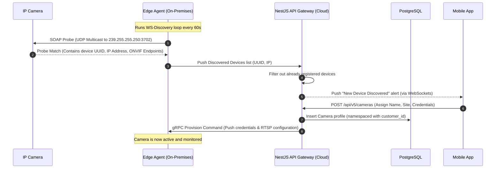
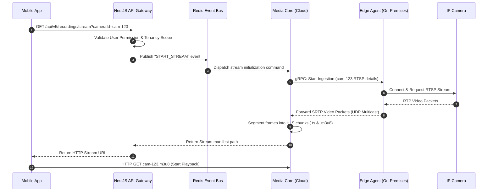
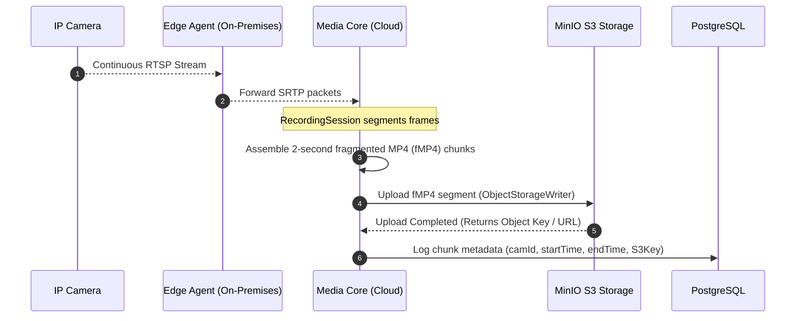
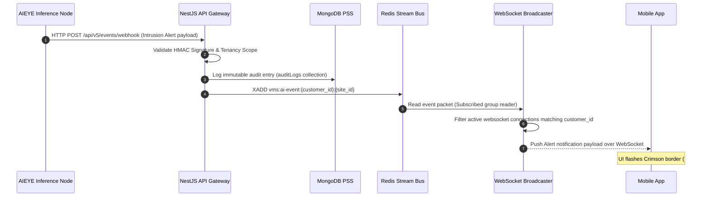
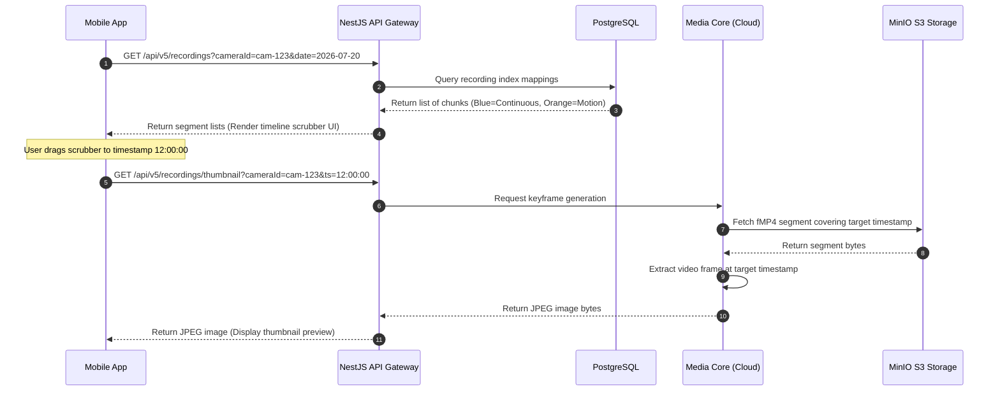
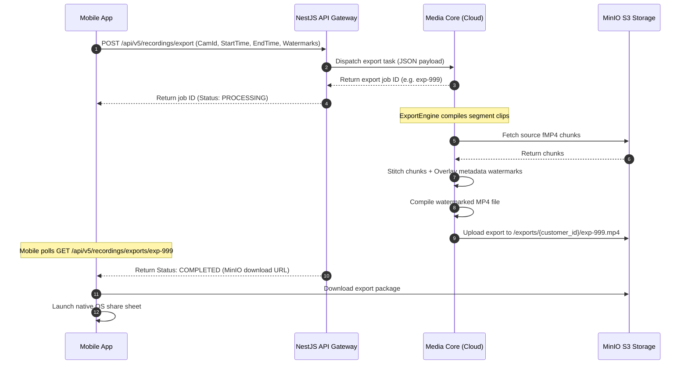
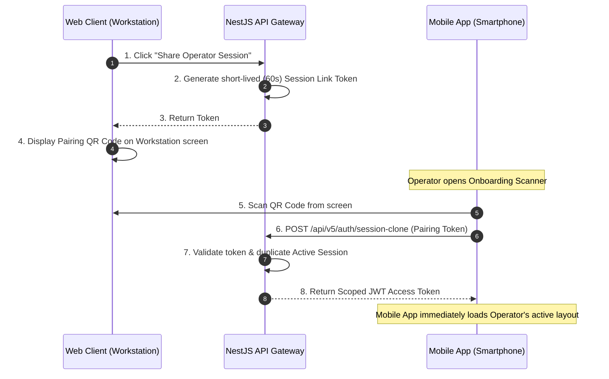

# Enterprise Video Management System (VMS) — Comprehensive Architectural Blueprint & Connectivity Specification

---

## 1. Executive Summary & Core Architectural Goals

The **Enterprise Video Management System (VMS)** is an enterprise-grade, cost-effective, centralized **Shared-Control-Plane B2B Multi-Tenant SaaS platform**. It manages up to **50,000 IP cameras** distributed globally across disparate networking topologies. 

```
                               ┌─────────────────────────────┐
                               │     Centralized Cloud       │
                               │  NestJS Control Plane + DB  │
                               └──────────────┬──────────────┘
                                              │
                      ┌───────────────────────┴───────────────────────┐
                      ▼                                               ▼
          ┌───────────────────────┐                       ┌───────────────────────┐
          │     On-Premises       │                       │      On-Premises      │
          │  Edge Agent (Site A)  │                       │  Edge Agent (Site B)  │
          └───────────┬───────────┘                       └───────────┬───────────┘
         ┌────────────┴────────────┐                     ┌────────────┴────────────┐
         ▼                         ▼                     ▼                         ▼
   [IP Camera 1]             [IP Camera 2]         [IP Camera 3]             [IP Camera 4]
```

### Core Architectural Goals
1.  **Multi-Tenant Isolation**: Enforce physical and logical segregation of camera configurations, recordings, audits, and live feeds using the Tenant Composite paradigm (`{customer_id}:{site_id}:{camera_id}`) across all layers.
2.  **Low Latency Streaming**: Achieve glass-to-glass latency of P95 <= 500ms on local subnets via UDP multicast, P95 <= 1.5s via TURN WebRTC, and fallback HLS streaming within P95 <= 5s.
3.  **High-Availability & Failover**: Ensure continuous cloud recordings and database recovery (Patroni failover RTO < 5 minutes, RPO < 30s same-city).
4.  **Hardware-Backed Client Security**: Sandbox sensitive tokens and cryptographic keys inside native mobile hardware cryptoprocessors (Keystore/Secure Enclave) instead of application local storage.

---

## 2. Component-by-Component Analysis (Deep Dive)

### 2.1. VMS Edge Agent (On-Premises Process)
The Edge Agent is a native C++ 17 application running inside a minimal Debian 12 container on site-level gateway hardware. It handles local camera discovery, media ingestion, and command routing.

```
+-------------------------------------------------------------+
|                      VMS Edge Agent                         |
|                                                             |
|   +-----------------------+     +-----------------------+   |
|   | CameraSessionManager  |     |     RtspPipeline      |   |
|   |  - CameraSession 1..N |     |     (GStreamer)       |   |
|   |    - PtzController    |     |  - rtsp-tee -> udp    |   |
|   +-----------------------+     +-----------------------+   |
|                                                             |
|   +-----------------------+     +-----------------------+   |
|   |    OnvifDiscovery     |     |     Telemetry/RPC     |   |
|   |  - SOAP WS-Discovery  |     |  - EdgeRpcServer      |   |
|   +-----------------------+     +-----------------------+   |
+-------------------------------------------------------------+
```

*   **`CameraSessionManager`**: Coordinates local connections to IP cameras. Spawns, monitors, and tears down individual `CameraSession` instances.
*   **`CameraSession`**: Wraps the physical runtime state of a single camera, enclosing its PTZ controller and ingestion pipeline.
*   **`PtzController`**: Emits ONVIF SOAP requests over HTTP using `libcurl` to move (Pan/Tilt), zoom, or focus the camera lens.
*   **`RtspPipeline`**: Built using GStreamer 1.22. It pulls the raw H.264/H.265 video stream from the camera's RTSP URL:
    *   **Jitter Buffer & Depayloader**: Buffers packets to prevent frame drops over local Wi-Fi/networks.
    *   **Tee Splitter**: Splits the decoded frame stream. One branch routes to an `appsink` for local frame analytics/callbacks, while the other maps to a `udpsink` which routes the stream via UDP multicast (`239.255.255.250`) to local viewing consoles without going to the WAN.
*   **`OnvifDiscovery`**: Uses SOAP over UDP multicast (`239.255.255.250:3702`) to discovery camera IP parameters automatically.
*   **`EdgeRpcServer` (`Port 50051`)**: A gRPC listener using mTLS. It executes incoming control plane instructions (e.g. "Pan Camera 3 Left", "Force Discovery Scan").

---

### 2.2. VMS Media Core (Cloud Process)
Running in centralized Kubernetes pods, the C++ Cloud Media Core performs streaming generation, recording segmenting, and clip exports.

```
+-------------------------------------------------------------+
|                      VMS Media Core                         |
|                                                             |
|   +-----------------------+     +-----------------------+   |
|   |  MediaSessionManager  |     |      LiveGateway      |   |
|   |  - CameraSessionState |     |  - HlsSession (m3u8)  |   |
|   |  - RecordingSession   |     |  - WebRtcSession      |   |
|   +-----------------------+     +-----------------------+   |
|                                                             |
|   +-----------------------+     +-----------------------+   |
|   |  ObjectStorageWriter  |     |     ExportEngine      |   |
|   |  - S3 / MinIO Uploader|     |  - Watermark & Stitch |   |
|   +-----------------------+     +-----------------------+   |
+-------------------------------------------------------------+
```

*   **`MediaSessionManager`**: Spawns and manages cloud-side camera state tracks.
*   **`RecordingSession`**: Captures incoming SRTP video packets and packages them into sequential fragmented MP4 (`fMP4`) recording blocks.
*   **`ObjectStorageWriter`**: Multi-threaded S3 client that uploads the `fMP4` segments directly to MinIO buckets under namespaced structures: `/recordings/{customer_id}/{site_id}/{camera_id}/{date}/{timestamp}.fmp4`.
*   **`LiveGateway`**: Governs live stream redistribution:
    *   **`HlsSession`**: Segments the stream into HLS chunks (`.ts` segments and updated `.m3u8` playlists) stored in a fast local cache directory (`/workspace/val_hls`).
    *   **`WebRtcSession`**: Employs WebRTC signaling via TURN/STUN (coturn fleet) to establish low-latency peer-to-peer tunnels with operator client applications.
*   **`ExportEngine`**: Performs server-side video clip editing. Stitches multiple sequential `fMP4` segments, decodes keyframes, overlays watermarks (Timestamp, Camera Name, Operator ID), and compiles a downloadable MP4.
*   **`PgRecordingIndex`**: Relational logging system that logs the metadata of every video chunk (start time, end time, recording type) into PostgreSQL.
*   **`RedisCommandWorker`**: Long-polling Redis consumer that processes incoming commands sent from the NestJS Control Plane.

---

### 2.3. VMS Control Plane (NestJS API Gateway)
The core NestJS application acts as the coordinator and API hub for the platform, exposing REST and WebSocket gateways.

```
+-------------------------------------------------------------+
|                    NestJS API Gateway                       |
|                                                             |
|   +-----------------------+     +-----------------------+   |
|   |      AuthModule       |     |     TenantsModule     |   |
|   |  - JWT / MFA / Vault  |     |  - Tenancy Isolation  |   |
|   +-----------------------+     +-----------------------+   |
|                                                             |
|   +-----------------------+     +-----------------------+   |
|   |     CamerasModule     |     |   RecordingsModule    |   |
|   |  - ONVIF Configs      |     |  - Timeline / Exports |   |
|   +-----------------------+     +-----------------------+   |
|                                                             |
|   +-----------------------+     +-----------------------+   |
|   |     EventsModule      |     |  ObservabilityModule  |   |
|   |  - Webhook Receiver   |     |  - Pino Logger        |   |
|   +-----------------------+     +-----------------------+   |
+-------------------------------------------------------------+
```

*   **`AuthModule`**: Enforces strict verification policies. Communicates with HashiCorp Vault to verify MFA secrets (`mfa_secret_ref`) and signs scoped 8-hour access tokens.
*   **`TenantsModule`**: Resolves the B2B subscription tier. Validates that every incoming query payload matches the scoped `customer_id` from the token.
*   **`CamerasModule`**: Resolves configuration details of the camera fleet. Issues PTZ commands down to the Edge Agent.
*   **`RecordingsModule`**: Provides timeline segments indexes, keyframe thumbnails generation endpoints, and coordinates evidence exports.
*   **`EventsModule`**: Asynchronously consumes event webhook signals from external AI nodes, logging them and routing them to active WebSocket rooms.

---

### 2.4. vms-ws-broadcaster (WebSocket Notification Service)
A dedicated Node.js service running independently of the API Gateway to prevent event surges from throttling API responsiveness.
*   **Persistent Connections**: Holds open persistent WebSocket connections with active client apps (Web, Desktop, Mobile).
*   **Redis Pub/Sub Bindings**: Subscribes to Redis cluster event channels: `cust-{customer_id}:site-{site_id}:alerts`.
*   **Real-time Alerts Dispatch**: Instantly forwards incoming camera disconnection metrics and AI detection notifications to targeted client screens.

---

### 2.5. Datastores & Infrastructure Layer

```
                        ┌─────────────────────────────────┐
                        │      Infrastructure Layer       │
                        └────────────────┬────────────────┘
                                         │
       ┌──────────────────┬──────────────┴───┬──────────────────┐
       ▼                  ▼                  ▼                  ▼
┌──────────────┐   ┌──────────────┐   ┌──────────────┐   ┌──────────────┐
│  PostgreSQL  │   │    Redis     │   │   MongoDB    │   │ HashiCorp    │
│  (Relational)│   │  (Cache/Bus) │   │ (Audit Logs) │   │    Vault     │
└──────────────┘   └──────────────┘   └──────────────┘   └──────────────┘
```

*   **PostgreSQL 16**: Relational storage mapping sites, users, roles, camera definitions, and recording indexes. Integrated with **Patroni** for high-availability synchronization.
*   **Redis 7**: Key-value data cache and event bus broker. Manages active operator session states, JWT revocation blacklists, and event streams.
*   **MongoDB 7 (PSS)**: Document store executing immutable append-only logs of every transaction for compliance and historical auditing.
*   **MinIO**: Private S3-compliant object storage storing recording files and evidence exports.
*   **HashiCorp Vault**: Secure key-value store containing sensitive items (e.g. database credentials, camera RTSP keys, MFA configuration references).

---

## 3. Technology Stack Rationale & Alternatives Matrix

| Layer | Chosen Technology | Rationale (Why) | Rejected Alternatives | Reason for Rejection |
| :--- | :--- | :--- | :--- | :--- |
| **Media Core** | **C++ 17 + GStreamer** | High-performance, zero garbage collection pauses, direct hardware decoder access (Intel QuickSync/NVIDIA NVDEC), robust pipeline-based stream assembly. | **Python (OpenCV/FFmpeg)** | High CPU overhead, Global Interpreter Lock (GIL) limits parallel thread scaling to 1,000+ streams. |
| **Control Plane** | **Node.js + NestJS** | Highly asynchronous event loop, fast I/O processing, strong architectural standardization, strict TypeScript type safety. | **Java (Spring Boot)** | Heavy resource footprint; thread-per-request model consumes excessive RAM under high WebSocket load. |
| **Database** | **PostgreSQL + Patroni** | Strong relational consistency, Row-Level Security, flexible JSONB indexing, robust multi-master replication failover. | **MySQL** | Lacks native row-level security policies and complex composite index scaling capabilities. |
| **Event Bus** | **Redis Streams** | Sub-millisecond latency, lightweight in-memory queues, supports transaction replays via offset limits. | **Apache Kafka** | Excessive infrastructure and configuration overhead for Phase 1 scaling targets. |
| **Storage** | **MinIO** | S3-compatible API, easily self-hosted on-premises or in private cloud, high write throughput. | **Local FS / NFS** | NFS introduces single points of failure, file locking conflicts, and lack of horizontal scaling. |
| **Security** | **HashiCorp Vault** | Secure hardware secret isolation, dynamic Intermediate CA PKI certificate rotation, robust transit encryption. | **Local `.env` Configs** | Storing plain text passwords in files or database rows increases threat vectors in compromised nodes. |
| **Mobile App** | **Flutter (Dart)** | Single codebase compiling to native ARM, high-performance Impeller GPU rendering, native platform channel access. | **React Native** | JS-bridge overhead causes frame drops and memory spikes during live video grid playback. |

---

## 4. Detailed Component Interactions (Sequence Diagrams)

### 4.1. Camera Discovery & Provisioning Flow
Shows how a new camera on the local network is discovered by the Edge Agent and registered in the Cloud.



---

### 4.2. Live Stream Request & Delivery Flow
Shows how a client requests and views a live camera feed.



---

### 4.3. Continuous Recording & Object Storage Upload Pipeline
Shows how video segments are captured, saved locally, and uploaded to the cloud object storage.



---

### 4.4. AIEYE Event Webhook & Real-Time Alert Distribution
Shows how an AI node triggers a detection, which is instantly broadcast to mobile operators.



---

### 4.5. Playback Timeline Scrubbing & Keyframe Generation
Shows how an operator scrubs the playback timeline and views video thumbnails.



---

### 4.6. Secure Watermarked Evidence Export Pipeline
Shows the workflow of selecting, watermarking, and downloading a secure video clip.



---

## 5. Security Architecture & Multi-Tenant Data Isolation

Data isolation is a primary security pillar. No flat indices are permitted; all records and transactions are namespaced using the tenant key: `{customer_id}`.

```
                              ┌─────────────────────────────┐
                              │     PostgreSQL Database     │
                              ├─────────────────────────────┤
                              │ tenant: customer_001        │
                              ├─────────────────────────────┤
                              │   - cam-1 (site-A)          │
                              │   - cam-2 (site-A)          │
                              └──────────────┬──────────────┘
                                             │
                       Enforced Row-Level Security (RLS) Filter
                                             │
                              ┌──────────────▼──────────────┐
                              │   Client App (Scoped token) │
                              │   customer_id: customer_001 │
                              └─────────────────────────────┘
```

1.  **Row-Level Security (RLS)**: Enforced inside PostgreSQL. All queries automatically append a `WHERE customer_id = CURRENT_USER_TENANT` filter using database policies.
2.  **MFA Secrets Security**: Plaintext MFA codes are banned in databases. Relational user tables map to an `mfa_secret_ref` VARCHAR string pointing to HashiCorp Vault.
3.  **Hardware-Backed Storage**: On mobile, the JWT refresh token is encrypted with an AES256-GCM key managed inside the Android Keystore (TEE) or iOS Keychain database (`kSecAttrAccessibleWhenUnlockedThisDeviceOnly`), isolating secrets from standard app memory dumps.
4.  **SPKI Certificate Pinning**: The mobile application pins against the **Intermediate CA certificate** (issued by HashiCorp Vault PKI) instead of the leaf certificate, preventing man-in-the-middle (MITM) attacks while ensuring zero connection breaks when leaf certificates rotate.

---

## 6. External Connectivity & Third-Party Integrations

### 6.1. Legacy NVR/DVR Bridges
To integrate legacy surveillance setups (which lack cloud connectivity or RTSP capabilities):
*   **Bridge Deployment**: A minimal Edge Agent container is installed on the local network containing the legacy NVR.
*   **Feeds Extraction**: The agent queries the NVR's SDK (e.g. Hikvision/Dahua SDK wrapper) to discover cameras and extract streams.
*   **Edge Ingestion**: The agent repackages the legacy streams into RTSP feeds and forwards them to the Cloud Media Core, matching the standard VMS protocol.

### 6.2. Custom Webhook Receivers
Enterprise clients can configure webhooks to receive real-time alerts in external systems (like Slack, Microsoft Teams, or custom Command Centers):

```
+──────────────────────────+       HTTPS Webhook       +──────────────────────────+
│    VMS Control Plane     │──────────────────────────>│  Client Command Center   │
│  (Trigger: AI Alert)     │                           │      (Custom App)        │
+──────────────────────────+                           +──────────────────────────+
```

*   **HMAC Signature**: The VMS Control Plane computes an HMAC SHA-256 signature of the payload using a client-specific secret key, appending it as an `X-VMS-Signature` header.
*   **Verification**: The client endpoint recalculates the HMAC to verify the payload's integrity and authenticity before processing the alarm.

---

## 7. Mobile App Sandbox & Hardware Token Storage (Flutter-specific)

To prevent unauthorized token extraction in the event of a device compromise, the mobile app isolates security primitives:

```
                  ┌──────────────────────────────────────────────┐
                  │                 Flutter App                  │
                  └──────────────────────┬───────────────────────┘
                                         │
                              Platform Channel Bridge
                                         │
                   ┌─────────────────────┴──────────────────────┐
                   ▼                                            ▼
       ┌───────────────────────┐                    ┌───────────────────────┐
       │   Android Platform    │                    │     iOS Platform      │
       ├───────────────────────┤                    ├───────────────────────┤
       │ EncryptedSharedPrefs  │                    │     iOS Keychain      │
       │ (Keystore AES256-GCM) │                    │ (kSecAttrAccessible)  │
       └───────────────────────┘                    └───────────────────────┘
```

### Android Security Primitive
*   **Android Keystore**: Generates a master AES-256 key inside the hardware-backed Trusted Execution Environment (TEE).
*   **EncryptedSharedPreferences**: Uses the Keystore master key to encrypt the token payload using AES256-GCM. The token bytes never touch the raw flash filesystem in plaintext.

### iOS Security Primitive
*   **Keychain Access**: Stores the token directly inside the Apple secure keychain database.
*   **Access Control Policies**: Set to `kSecAttrAccessibleWhenUnlockedThisDeviceOnly` to prevent iCloud backup sync and block token extraction when the device is locked.

---

## 8. Mobile App & Web App Sync & Interaction Flows

In this shared-control-plane architecture, the Mobile App and the Web App do not communicate with each other directly in a peer-to-peer fashion. Instead, they interact dynamically by sharing the central control plane, database entities, and real-time WebSocket state channels.

```
+───────────────────────────+                 +───────────────────────────+
│         Web Client        │                 │         Mobile App        │
│    (Vite React 18 SPA)    │                 │      (Flutter 3.x)        │
+─────────────┬─────────────+                 +─────────────┬─────────────+
              │                                             │
      HTTPS REST / WSS                              HTTPS REST / WSS
              │                                             │
              └───────────────┬─────────────────────────────┘
                              ▼
               +──────────────────────────────+
               │     NestJS API Gateway       │
               │  (Shared Database Registry)  │
               +──────────────────────────────+
```

### 8.1. Indirect Interaction Channels
Because both client interfaces connect to the same backend instances, any state mutation initiated in one client instantly reflects in the other:

1.  **Site Configuration & Camera List Update**:
    *   *Action*: An administrator uses the Web App to add a new camera or edit site details.
    *   *Interaction*: The Web Gateway saves modifications to **PostgreSQL**.
    *   *Propagation*: NestJS emits a configuration update over Redis to the **WebSocket Broadcaster**.
    *   *Result*: The Mobile App (subscribed to `/ws/v5/telemetry`) receives the updated registry payload and dynamically updates its local camera directory without requiring an app reload.
2.  **Incident & Alarm Acknowledgment Sync**:
    *   *Action*: A mobile operator on patrol notices an alarm popup and taps "Acknowledge" on their phone.
    *   *Interaction*: Mobile sends `PATCH /api/v5/alarms/{id}/acknowledge` to the NestJS Gateway.
    *   *Propagation*: The Gateway logs the action in **MongoDB** and publishes the event to Redis.
    *   *Result*: The Web App (open in the central control room) instantly receives the acknowledgment event via WebSockets and dims the flashing alarm frame, preventing duplicate operator interventions.

### 8.2. Direct Web-to-Mobile Handshake (QR Workflows)
For seamless transitions between workstation consoles and mobile devices, the system implements direct visual handshakes:



*   **Operator Session Pairing**: Allows patrol officers to clone their desktop terminal session onto their mobile device instantly. The Web App displays a short-lived QR code containing a secure pairing token. The mobile operator scans this QR code to log in and automatically mirror the current workstation dashboard/camera layout.
*   **Evidence Clip Handover**: When the Web App finishes generating an MP4 evidence export, it displays a download QR code. An operator can scan this QR code with the Mobile App to load and play the watermarked evidence clip directly inside the native mobile media player, or share it using the OS share sheet.
