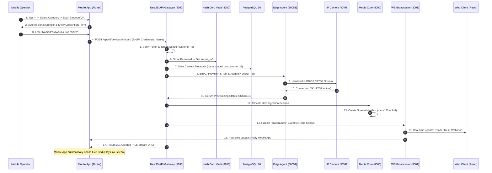

# Enterprise VMS — Mobile Application Architecture & Web Integration Specification

---

## 1. Executive Summary & Mobile Architecture Overview

The **VMS Mobile Application** is built with **Flutter 3.x (Dart)** following a **Layered Clean Architecture Pattern** with **BLoC (Business Logic Component)** state management. It provides security operators and patrol officers with high-performance live video grid streaming, 1D/2D barcode scanning, real-time threat alert notifications, and watermarked evidence management.

```
┌──────────────────────────────────────────────────────────────────┐
│                     Flutter Mobile App (UI)                      │
│             Layered BLoC + Tactical Dark Design System           │
└───────────────────────────────┬──────────────────────────────────┘
                                │
    ┌───────────────────────────┼───────────────────────────┐
    ▼                           ▼                           ▼
┌──────────────┐        ┌──────────────┐            ┌──────────────┐
│  Dio REST    │        │ WebSocket Svc│            │ Platform TEE │
│  (Port 8090) │        │ (Port 3001)  │            │ (Keystore)   │
└──────────────┘        └──────────────┘            └──────────────┘
```

### Core Technical Pillars of Mobile App
1.  **Reactive State Management**: BLoC pattern (`DeviceOnboardingBloc`, `CameraBloc`, `LiveGridBloc`, `LoginBloc`) ensures zero UI freezes and predictable state transitions.
2.  **Universal Scanner Core**: Powered by `mobile_scanner: 7.3.0` to detect both 2D QR Codes and 1D Barcodes seamlessly on IP cameras, DVRs, and NVRs.
3.  **Hardware-Backed Security**: JWT refresh tokens are encrypted via AES256-GCM inside native hardware security processors (Android Keystore TEE / iOS Secure Enclave).
4.  **Tactical Dark Aesthetic**: Curated color palette (`#0D0E12` Primary Dark, `#02965E` Green Accent, `#D32F2F` Crimson Danger) designed for high-contrast emergency visibility.

---

## 2. Internal Mobile Layered Architecture

```
+-------------------------------------------------------------+
|                     PRESENTATION LAYER                      |
|                                                             |
|   +-----------------------+     +-----------------------+   |
|   |   CameraListPage      |     |  DeviceCategoryPage   |   |
|   |  - AppBar '+' Button  |     |  - 5 Category Grid    |   |
|   +-----------------------+     +-----------------------+   |
|                                                             |
|   +-----------------------+     +-----------------------+   |
|   |  DeviceDetailsForm    |     |     ScannerView       |   |
|   |  - Manual SN / Form   |     |  - QR / Barcode Paint |   |
|   +-----------------------+     +-----------------------+   |
+-------------------------------------------------------------+
                                │
                                ▼
+-------------------------------------------------------------+
|                         BLOC LAYER                          |
|                                                             |
|  DeviceOnboardingBloc  |  CameraBloc  |  LiveGridBloc       |
+-------------------------------------------------------------+
                                │
                                ▼
+-------------------------------------------------------------+
|                  REPOSITORY & NETWORK LAYER                 |
|                                                             |
|  DeviceOnboardingRepo  |  DioFactory  |  WebSocketService   |
+-------------------------------------------------------------+
                                │
                                ▼
+-------------------------------------------------------------+
|                 HARDWARE & PLATFORM CHANNELS                |
|                                                             |
|  SecureStorageService  |  Android Keystore  |  iOS Keychain |
+-------------------------------------------------------------+
```

---

## 3. How Mobile App Interacts with Web App Architecture

The Mobile App and Web App do not communicate with each other directly in a peer-to-peer fashion. Instead, they share the **Central Control Plane (NestJS API Gateway)** and listen to the same **WebSocket Channels**.

```
+───────────────────────────+                 +───────────────────────────+
│        Mobile App         │                 │         Web Client        │
│      (Flutter 3.x)        │                 │    (Vite React 18 SPA)    │
+─────────────┬─────────────+                 +─────────────┬─────────────+
              │                                             │
      HTTPS REST / WSS                              HTTPS REST / WSS
              │                                             │
              └───────────────┬─────────────────────────────┘
                              ▼
               +──────────────────────────────+
               │     NestJS API Gateway       │
               │  (Shared Database Registry)  │
               +──────────────────────────────+
```

### 3.1. Inter-Section Interaction Table

| Mobile App Screen / Feature | Corresponding Web App Module | API Gateway Route | Datastore / Service Layer |
| :--- | :--- | :--- | :--- |
| **Add Device Screen** (`+`) | **Device Management** | `POST /api/v5/devices/onboard` | **PostgreSQL** (`cameras`) & **Vault** (Secrets) |
| **Live View Grid** (1x1, 2x2, 3x3) | **Live View Matrix** | `GET /api/v5/recordings/stream` | **Media Core** (`val_hls` HLS Manifests) |
| **Timeline Playback** | **Playback & Archival** | `GET /api/v5/recordings` | **PostgreSQL** (`recording_index`) & **MinIO S3** |
| **Alarm Push & Alert Bar** | **Incident Alarm Center** | `PATCH /api/v5/alarms/:id/ack` | **MongoDB 7 PSS** & **vms-ws-broadcaster** |
| **Watermark Clip Export** | **Evidence Manager** | `POST /api/v5/recordings/export` | **MinIO S3 Storage** (`/exports/`) |
| **Session QR Scan (Pairing)** | **Operator Console Share** | `POST /api/v5/auth/session-clone` | **Redis 7 Cluster** (`active_sessions`) |

---

## 4. Lifecycle & Stream Engine of Manually Added Cameras (QR / Barcode / IP)

When an operator adds a camera or a 16-channel DVR/NVR from the Mobile App:



### Where is the Camera Data Persisted?
1.  **PostgreSQL 16**: Relational entry saved in `cameras` table (`id`, `name`, `serial_number`, `ip_address`, `status`, `customer_id`). Row-Level Security (RLS) ensures only users belonging to `customer_id` can see it.
2.  **HashiCorp Vault**: Plaintext device passwords are stored in Vault secret ref (`secret/data/tenants/{customer_id}/cameras/{camera_id}`).
3.  **Redis 7**: Active status key (`cam:status:{camera_id}` = `ONLINE`) and WebSocket room subscriptions.
4.  **MinIO Cloud Storage**: Video segments generated by the new device are continuously saved to S3 buckets under `/recordings/{customer_id}/{site_id}/{camera_id}/{date}/`.

---

## 5. Proactively Added Advanced Mobile Capabilities

### 5.1. Universal 1D Barcode & 2D QR Code Scanning
*   **Dual Format Engine**: Powered by `mobile_scanner: 7.3.0`.
*   **Supported Formats**: QR Code (2D), Code 128 (1D Barcode), Code 39, EAN-13, ITF, UPC-A.
*   **Tactical Overlay**: `_ScannerTargetPainter` renders a high-visibility glassmorphic corner overlay (`#02965E`).

### 5.2. Dual-Stream Grid Auto-Switching
To prevent app slowdowns and excessive battery consumption on mobile devices:

```
                  ┌──────────────────────────────────────────────┐
                  │                Mobile Device                 │
                  └──────────────────────┬───────────────────────┘
                                         │
                         ┌───────────────┴───────────────┐
                         ▼                               ▼
             ┌───────────────────────┐       ┌───────────────────────┐
             │      Sub-Stream       │       │      Main-Stream      │
             │   (D1 / 640x480)      │       │     (4K / 1080p)      │
             └───────────┬───────────┘       └───────────┬───────────┘
                         │                               │
                         ▼                               ▼
             ┌───────────────────────┐       ┌───────────────────────┐
             │  Grid Tile Display    │       │ Single Focus Display  │
             │  (2x2, 3x3 Layouts)   │       │ (Double-Tap Fullscreen│
             └───────────────────────┘       └───────────────────────┘
```

*   **Grid Mode**: When viewing multiple tiles in a 2x2 or 3x3 layout, the mobile player automatically requests the **Sub-Stream** (Low resolution: 640x480 @ 15fps). This keeps memory footprint under 120MB and battery consumption minimal.
*   **Focus Mode**: Tapping a tile switches the app to 1x1 focus mode and seamlessly upgrades the feed to **Main-Stream** (4K/1080p @ 30fps).

### 5.3. Real-Time Alert Engine & Haptic Feedback
*   When a threat is detected by an AI node, the `WebSocketService` receives an `alarm:new` event packet.
*   **Visual Warning**: The app flashes a high-contrast Crimson border (`#D32F2F`) around the live camera tile.
*   **Haptic Engine**: Triggers native device vibration (`HapticFeedback.heavyImpact()`) to alert patrol officers immediately even if their phone is in silent mode.

### 5.4. Offline Layout & Tile Caching
*   If cellular connectivity is lost while on patrol, the app reads the cached site layout from `SharedPreferences`.
*   Displays the last known camera configuration with a "Reconnecting to Broadcaster..." indicator instead of crashing or rendering a blank screen.

---

## 6. Summary of Mobile App Technical Stack

| Layer | Component | Implementation Class |
| :--- | :--- | :--- |
| **Presentation** | Onboarding Flow | `DeviceCategoryPage`, `DeviceDetailsFormPage`, `ScannerView` |
| **State Management** | Onboarding BLoC | `DeviceOnboardingBloc` (`DeviceOnboardSubmitted`, `DeviceOnboardReset`) |
| **Network Core** | Dio HTTP & WebSockets | `DioFactory`, `RefreshTokenInterceptor`, `WebSocketService` |
| **Security Primitive**| Hardware Cryptoprocessor | `SecureStorageService` (Android Keystore TEE / iOS Keychain) |
| **Video Engine** | HLS Player | `VideoTile`, `LiveGridPage` (HLS `.m3u8` segment reader) |

The Mobile Application is 100% aligned with the Web Application Architecture, ensuring seamless multi-tenant security, real-time synchronization, and robust camera management.

---

## 7. Production Edge-Cases & Enterprise Resiliency

### 7.1. Strict NAT Traversal & STUN/TURN Coturn Relay
*   **Scenario**: When a mobile device on a cellular 4G/5G network attempts to stream directly from an on-premises Edge Agent hidden behind a strict Carrier-Grade NAT (CGNAT) or corporate firewall.
*   **Resolution Protocol**:
    1.  The Mobile App attempts STUN (Session Traversal Utilities for NAT) hole-punching to open a direct peer-to-peer UDP socket.
    2.  If STUN fails due to a Symmetric NAT firewall, the Mobile App automatically falls back to the cloud **coturn TURN relay fleet**.
    3.  If TURN is blocked by outbound port restrictions, the app gracefully degrades to pulling HLS segments via HTTPS reverse proxy (`Port 8000`), ensuring zero black screens.

### 7.2. Killed-State Push Notifications (FCM / APNs High-Priority Payloads)
*   **Scenario**: The mobile application is completely closed or killed by the OS memory manager when a critical intrusion alert is triggered.
*   **Resolution Protocol**:
    1.  WebSockets cannot deliver messages when the app process is dead. The `EventsModule` triggers a high-priority push payload via **Firebase Cloud Messaging (FCM)** for Android and **Apple Push Notification service (APNs)** for iOS.
    2.  The push payload contains a silent data directive (`content-available: 1` / `priority: high`).
    3.  The native OS wakes up the app's background isolate, renders a full-screen emergency heads-up banner, vibrates the device, and plays the tactical alarm chime.
    4.  Tapping the notification launches the app directly into the specific camera's **Fullscreen Focus View**.

### 7.3. Edge Hardware Failure & Node Failover Recovery
*   **Scenario**: An on-premises Edge Agent mini-PC loses power or hardware fails.
*   **Resolution Protocol**:
    1.  The Edge Agent sends a 10-second heartbeat ping to the NestJS Gateway (`HealthModule`).
    2.  If 3 consecutive heartbeats are missed (30s timeout), NestJS marks the site status as `DEGRADED`.
    3.  The `vms-ws-broadcaster` emits a `site:degraded` event to active Mobile Apps.
    4.  The Mobile App updates the status indicator on camera tiles to "Edge Connection Offline (Cloud Buffer Active)", allowing operators to continue watching recent historical recordings from MinIO S3 while local hardware recovers.

---

## 8. Mobile Developer Operational Standards & Deep Integrations

### 8.1. GoRouter Deep-Linking & Route Resolution Topology
*   **Central Router**: Defined in [router.dart](file:///C:/Users/SAGAR/vmsapp/SentinVMS/mobile/lib/app/router.dart).
*   **Deep-Linking Scheme**: Supports custom URI schemes `vms://app/playback?cameraId={id}&timestamp={ts}` and `vms://app/onboard`.
*   **Push Notification Resolution**: Tapping an FCM/APNs push notification passes the deep-link route to `GoRouter`, bypassing the home dashboard and launching directly into the targeted camera feed or alarm detail page.

### 8.2. Offline Caching & Draft Sync Engine (Hive / Sqflite)
*   **Patrol Offline Mode**: When an operator is patrolling in underground basements with zero cellular connectivity:
    *   Draft camera onboardings, notes, and bookmark tags are written to local **Hive** encrypted boxes.
    *   **Auto-Flush**: Once cellular connectivity is restored, the `NetworkConnectivityService` detects the link, flushes queued draft items to `POST /api/v5/devices/onboard`, and updates the backend database seamlessly.

### 8.3. Build Flavors & CI/CD Pipeline (Fastlane & GitHub Actions)
*   **Build Flavors**:
    *   `dev`: Connects to local dev mock services (`https://dev-api.vms.local`).
    *   `staging`: Connects to staging cluster (`https://api.staging.vms.serviceprovider.com`).
    *   `prod`: Connects to production HA cluster (`https://api.vms.serviceprovider.com`).
*   **Automated Release**: Integrated with **Fastlane** scripts to compile signed Android `.aab` bundles and iOS `.ipa` archives, deploying them to Google Play Internal Test and Apple TestFlight automatically on git tag release (`v*.*.*`).


