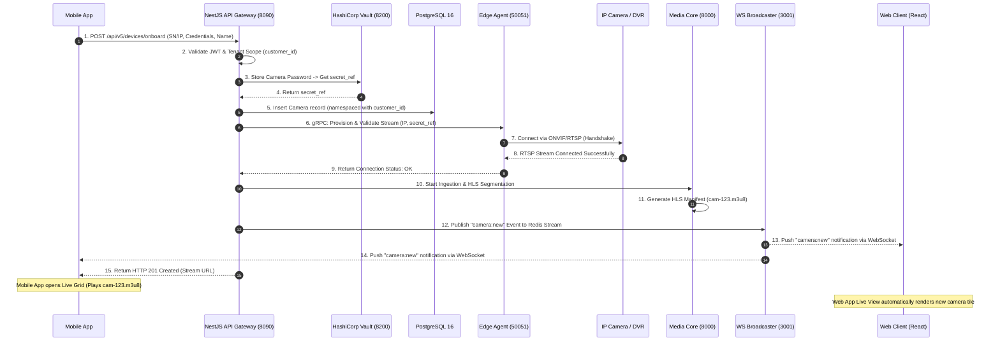
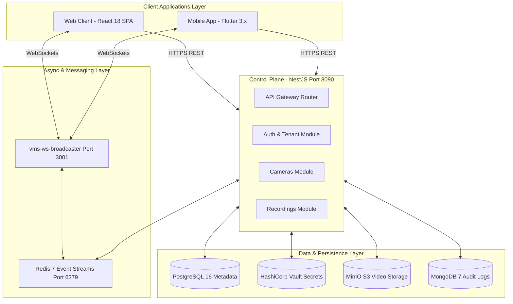

# Enterprise VMS — Web Application Architecture & Mobile Integration Specification

---

## 1. Executive Summary & Web Application Overview

The **Web Application** serves as the primary central command console for security operators, system administrators, and enterprise managers. Built with a modern **React 18 SPA (Vite + TypeScript)** architecture, it communicates through an **Nginx Reverse Proxy (`Port 8085`)** to the **NestJS API Gateway (`Port 8090`)**, **WebSocket Broadcaster (`Port 3001`)**, and **Media Core (`Port 8000`)**.

```
  ┌──────────────────────────────────────────────────────────────────┐
  │                    Web Client (React 18 SPA)                     │
  │                  Served by Nginx (Port 8085)                     │
  └───────────────────────────────┬──────────────────────────────────┘
                                  │
      ┌───────────────────────────┼───────────────────────────┐
      ▼                           ▼                           ▼
┌──────────────┐          ┌──────────────┐            ┌──────────────┐
│ NestJS REST  │          │ WS Broadcast │            │  Media Core  │
│ (Port 8090)  │          │ (Port 3001)  │            │ (Port 8000)  │
└──────────────┘          └──────────────┘            └──────────────┘
```

### Core Web Application Sections & Components
1.  **Dashboard & Operational Summary**: System health overview, camera online/offline tallies, active alert counts.
2.  **Live View Matrix (1x1, 2x2, 3x3, 4x4 Grid)**: High-performance HLS video player matrix rendering real-time camera feeds.
3.  **Playback & Timeline Scrubbing**: Historical video search, event marker visualization, and keyframe thumbnail previews.
4.  **Device & Site Management**: Multi-site hierarchy tree, camera configuration, ONVIF PTZ profiles, and Edge Agent status monitors.
5.  **Incident & Alarm Center**: Real-time alarm queue, AIEYE webhook detection alerts, and operator acknowledgment workflows.
6.  **Admin & Tenant Control**: Role-Based Access Control (RBAC), user provisioning, MFA configuration, and audit log inspection.

---

## 2. Section-by-Section Interaction Matrix (Mobile App vs Web App)

The Mobile App and Web App do not talk to each other directly; they maintain **100% Data Parity** by querying the same central API Gateway and listening to the same WebSocket channels.

| Mobile App Feature | Target Web App Section | Shared API Gateway Endpoint | Datastore Persistence Layer | Real-time Synchronization Channel |
| :--- | :--- | :--- | :--- | :--- |
| **Device Onboarding** (QR / Barcode / Manual IP) | **Device & Site Management** | `POST /api/v5/devices/onboard` | **PostgreSQL** (`cameras` table) & **HashiCorp Vault** (Password ref) | `Redis Stream` -> `vms-ws-broadcaster` (`camera:status`) |
| **Live View Grid** (1x1, 2x2, 3x3) | **Live View Matrix** | `GET /api/v5/recordings/stream` | **Media Core** (`val_hls` cache) | `Socket.io` (`/ws/v5/telemetry`) |
| **Playback & Timeline** | **Playback & Search** | `GET /api/v5/recordings` | **PostgreSQL** (`recording_index`) & **MinIO S3** (`.fmp4` files) | `N/A` (On-demand query) |
| **Alarm Center & Push Alerts** | **Incident & Alarm Center** | `PATCH /api/v5/alarms/:id/ack` | **MongoDB 7 PSS** (`auditLogs` & `alarmEvents`) | `Redis Stream` -> `vms-ws-broadcaster` (`alarm:new`) |
| **Watermarked Clip Export** | **Evidence Export Manager** | `POST /api/v5/recordings/export` | **MinIO S3** (`/exports/{customer_id}/`) | `vms-ws-broadcaster` (`export:status`) |
| **Session Pairing (QR Scan)** | **Operator Session Share** | `POST /api/v5/auth/session-clone` | **Redis 7 Cluster** (`active_sessions`) | `N/A` (Direct Token Handshake) |

---

## 3. Data Lifecycle of Manually Added Cameras (Mobile to Web)

When an operator adds a camera or DVR/NVR manually (or via QR/Barcode) on the Mobile App, it undergoes a multi-layer persistence and activation flow.

```
                              ┌──────────────────────────────────┐
                              │ Mobile App Onboard Request       │
                              │ (SN / IP / Username / Password)  │
                              └────────────────┬─────────────────┘
                                               │
                                               ▼
                              ┌──────────────────────────────────┐
                              │ NestJS API Gateway               │
                              │  - Auth & Tenant Scope Check     │
                              └────────────────┬─────────────────┘
                                               │
       ┌────────────────────────┬──────────────┴─────────┬────────────────────────┐
       ▼                        ▼                        ▼                        ▼
┌──────────────┐        ┌──────────────┐        ┌──────────────┐        ┌──────────────┐
│  PostgreSQL  │        │  HashiCorp   │        │    Redis     │        │  Edge Agent  │
│ (Metadata)   │        │    Vault     │        │   (Cache)    │        │    (gRPC)    │
└──────────────┘        └──────────────┘        └──────────────┘        └──────────────┘
```

### 3.1. Where is the Camera Data Saved?

1.  **PostgreSQL 16 Database (`cameras` & `sites` tables)**:
    *   *Saved Data*: Camera ID, Tenant ID (`customer_id`), Site ID (`site_id`), Device Name (e.g. "Front Gate Camera"), Serial Number, IP Address/RTSP Endpoint, Channel Count, and ONVIF Capabilities.
    *   *Constraint*: Composite tenant key `{customer_id}` ensures Row-Level Security (RLS) isolation.
2.  **HashiCorp Vault (`Port 8200`)**:
    *   *Saved Data*: Plaintext passwords and camera login credentials are **NEVER** stored in PostgreSQL. They are stored inside Vault under `secret/data/tenants/{customer_id}/cameras/{camera_id}`.
    *   *Reference*: PostgreSQL only stores an encrypted reference key string (`vault_secret_ref`).
3.  **Redis 7 Cluster**:
    *   *Saved Data*: Active camera online/offline status (`cam:status:{camera_id}` = `ONLINE`) and current active streaming sessions.
4.  **MinIO S3 Object Storage**:
    *   *Saved Data*: Once added, the video recordings generated by this camera are saved under `/recordings/{customer_id}/{site_id}/{camera_id}/{date}/{timestamp}.fmp4`.

---

### 3.2. Step-by-Step Execution Sequence Diagram

This diagram illustrates what happens from the moment an operator taps **Save** on the Mobile App until the camera starts playing live on both Mobile and Web consoles.



---

## 4. How Added Cameras Play Live on Web & Mobile

### 4.1. Single Camera Stream Pipeline
*   When a single IP Camera is added, the Media Core creates an HLS session (`HlsSession`).
*   It outputs a `.m3u8` manifest file (e.g., `http://media-core:8000/live/{customer_id}/{camera_id}/index.m3u8`).
*   Both the Web App's `HLS Video Player` (`hls.js`) and the Mobile App's native video player pull 2-second `.ts` video segments continuously.

### 4.2. Multi-Channel DVR / NVR Stream Pipeline
*   When a 4, 8, or 16-Channel DVR/NVR is added, the Edge Agent queries the device's main channel directory.
*   The backend registers individual sub-camera feeds (`cam-123-ch1`, `cam-123-ch2`, ... `cam-123-ch16`).
*   **Web App Grid**: The Web App automatically adapts its view matrix to a **4x4 (16-tile) grid layout**.
*   **Mobile App Grid**: The Mobile App adapts to a scrollable **2x2 / 3x3 layout**, allowing operators to swipe between channel pages smoothly.

---

## 5. Critical Advanced Architectural Features (Proactively Added)

### 5.1. Dual-Stream Auto-Switching (Sub-Stream vs Main-Stream)
To prevent network overload and CPU crash when displaying multiple live feeds simultaneously:

```
                  ┌──────────────────────────────────────────────┐
                  │                 IP Camera                    │
                  └──────────────────────┬───────────────────────┘
                                         │
                         ┌───────────────┴───────────────┐
                         ▼                               ▼
             ┌───────────────────────┐       ┌───────────────────────┐
             │      Sub-Stream       │       │      Main-Stream      │
             │   (D1 / 640x480)      │       │     (4K / 1080p)      │
             └───────────┬───────────┘       └───────────┬───────────┘
                         │                               │
                         ▼                               ▼
             ┌───────────────────────┐       ┌───────────────────────┐
             │ Multi-Tile Grid View  │       │ Single Tile Fullscreen│
             │  (2x2, 3x3, 4x4 Grid) │       │   (Detailed Focus)    │
             └───────────────────────┘       └───────────────────────┘
```

*   **Grid View (Multi-Tile)**: When watching 4, 9, or 16 cameras on screen, the system automatically pulls the **Sub-Stream** (Low resolution: 640x480 @ 15fps, ~300 Kbps). This keeps total CPU/RAM usage low and bandwidth under 5 Mbps.
*   **Fullscreen Focus**: When an operator taps/clicks a specific camera tile to view it full screen, the app seamlessly switches to the **Main-Stream** (High resolution: 4K/1080p @ 30fps, ~4 Mbps) for maximum visual clarity.

### 5.2. Bandwidth Adaptive Fallback Engine
*   If a mobile operator's cellular network drops from 5G to 3G/LTE:
    *   The Mobile App detects packet loss and signals the Media Core (`PATCH /api/v5/recordings/stream/bitrate`).
    *   The Media Core dynamically drops the HLS bitrate profile from 1080p down to 360p without interrupting playback.

### 5.3. Edge Offline Recording & Synchronization
*   If internet connectivity between the site (Edge Agent) and the Cloud drops:
    *   **Local Buffering**: The Edge Agent continues capturing streams from local IP cameras and saves recording segments directly to local SSD/SD storage.
    *   **Auto-Sync on Reconnect**: As soon as the WAN link restores, the Edge Agent asynchronously uploads missing `fMP4` segments to MinIO Cloud S3 and updates PostgreSQL recording indexes. No video data is lost.

### 5.4. CGNAT NAT Traversal & STUN/TURN Coturn Fleet
*   **STUN/TURN Integration**: Allows clients (Web & Mobile) on restricted cellular/NAT networks to open peer-to-peer WebRTC connections to on-premises Edge Agents. If STUN fails due to symmetric firewalls, media automatically relays through the `coturn` TURN cluster or falls back to HLS streaming over HTTPS (`Port 8000`).

### 5.5. FCM & APNs High-Priority Push Payloads
*   **Killed-State Alarm Delivery**: When mobile or web client processes are dead/closed, NestJS's `EventsModule` dispatches FCM (Android) and APNs (iOS) silent data payloads with high priority, waking background isolates to trigger emergency banners and haptic feedback.

### 5.6. Edge Heartbeat Monitor & Cloud Node Failover
*   **Heartbeat Circuit**: Edge Agents emit a 10-second heartbeat ping to NestJS `HealthModule`.
*   **Auto-Failover**: If pings fail for 30s, the backend marks site status as `DEGRADED`, notifies active client sockets, and reroutes historical playback queries directly to MinIO S3 cloud storage.

---

## 6. Summary of Web & Mobile Architectural Integration



Both the **Mobile App** and **Web App** share identical data access standards, tenant isolation boundaries, and real-time communication bridges, ensuring a complete, scalable, enterprise-grade Video Management System.
