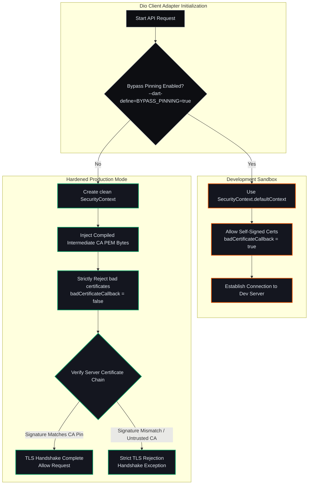
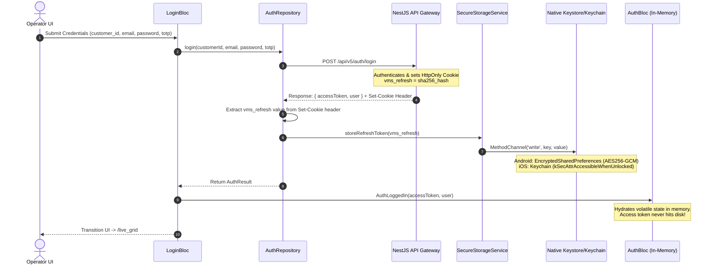
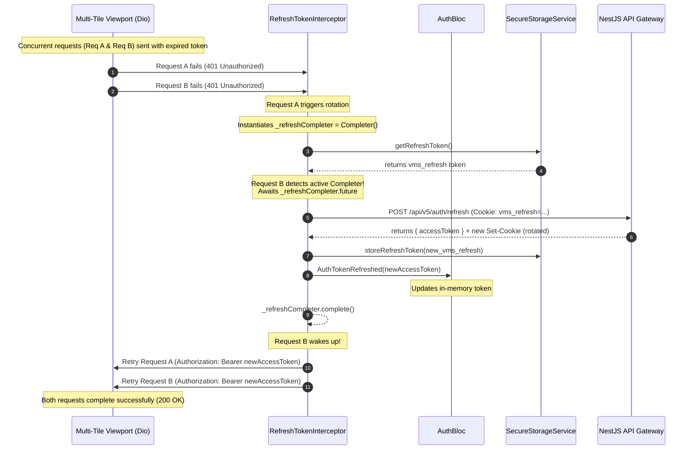
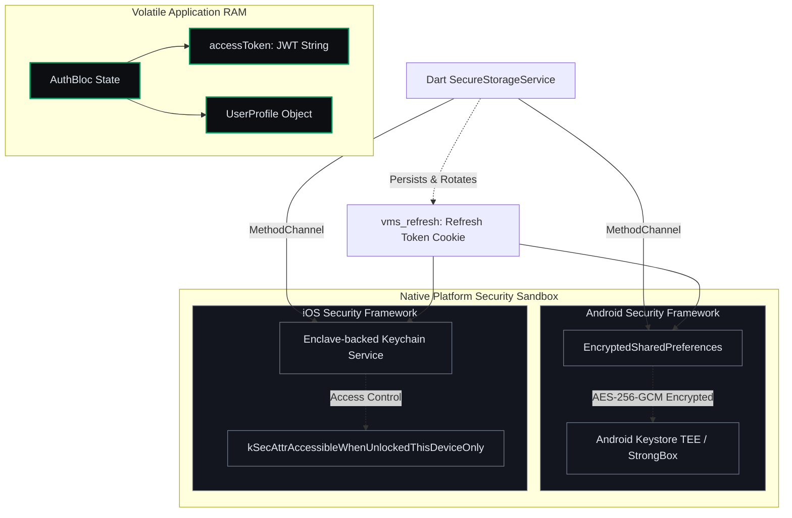

# Enterprise VMS Mobile Client — Micro-Phase A Architectural Blueprint

This document contains visual architectural specifications, flow diagrams, and detailed descriptions of **Micro-Phase A: Security, Auth & Storage (Foundation)**. 

You can directly copy-paste the `mermaid` code blocks below into any markdown editor (like VS Code, GitHub) or the **[Mermaid Live Editor](https://mermaid.live)** to generate vector diagrams for design reviews, presentations, or onboarding team members.

---

## Table of Contents
1. [Network Layer Trust Validation (Intermediate CA Pinning & Dev Bypass)](#1-network-layer-trust-validation)
2. [Secure Multi-Tenant Login Sequence](#2-secure-multi-tenant-login-sequence)
3. [Concurrent Token Rotation & RefreshLock Flow](#3-concurrent-token-rotation--refreshlock-flow)
4. [Memory Separation Architecture (Volatile RAM vs. OS Sandboxing)](#4-memory-separation-architecture)
5. [Code Mapping Reference](#5-code-mapping-reference)

---

## 1. Network Layer Trust Validation

### The Problem it Solves
Standard mobile applications trust all Root Certificate Authorities (CAs) pre-installed on the user's operating system. If a malicious actor installs a rogue Root CA on a device (or compromises a public CA), they can conduct a Man-in-the-Middle (MitM) attack, decrypting TLS traffic. 

### Architectural Approach
We restrict the application's network client (`Dio`) to **only trust our specific Intermediate CA certificate**. This is called **SPKI (Subject Public Key Info) Pinning** at the certificate chain level.
* **Production Mode:** Native `SecurityContext` rejects all traffic unless verified by the compiled PEM-encoded Intermediate CA certificate.
* **Development Mode:** An environment flag (`--dart-define=BYPASS_PINNING=true`) triggers a fallback to the OS default context, enabling bad certificate callbacks for self-signed development certificates on local emulators.

### Mermaid Diagram Code

---

## 2. Secure Multi-Tenant Login Sequence

### The Problem it Solves
User credentials and sessions must be sharded by tenant identifier (`customer_id`) to ensure isolation in Vivek's Control Plane. Access tokens must remain transient, while refresh tokens must be securely stored inside platform hardware without manual interception.

### Architectural Approach
1. The user logs in with credentials alongside their `customer_id`.
2. The server responds with a short-lived `accessToken` in the JSON body, and a long-lived `vms_refresh` token via a secure `Set-Cookie` header.
3. The client repository extracts the `vms_refresh` token, saving it to secure native hardware storage via platform method channels, and fires an event to transition the state machine (`AuthBloc`) using only the volatile access token in RAM.

### Mermaid Diagram Code

---

## 3. Concurrent Token Rotation & RefreshLock Flow

### The Problem it Solves
When a multi-tile dashboard viewport loads, the app fires multiple parallel API calls simultaneously. If the access token expires, all concurrent calls return a `401 Unauthorized` status at the same moment. Without a concurrency gate (a "Refresh Lock"), the app would attempt to refresh the token multiple times concurrently, causing race conditions, invalidating rotated tokens, and force-logging the user out.

### Architectural Approach
We use an asynchronous **`Completer`** lock in the `RefreshTokenInterceptor`:
1. The first request that fails with a `401` instantiates a `Completer<void>? _refreshCompleter = Completer()`.
2. Subsequent `401` errors detect this active completer and pause their execution by awaiting its future.
3. Once the first request successfully executes the token refresh and stores the new credentials, it completes the completer, resolving the paused queue.
4. All waiting requests wake up, update their headers with the brand new access token, and retry their operations without the user experiencing any interruption.

### Mermaid Diagram Code

---

## 4. Memory Separation Architecture

### The Problem it Solves
If a device is root-compromised or subjected to physical memory extraction, any sensitive security token stored on the persistent disk layer can be recovered. 

### Architectural Approach
We enforce strict data containment zones:
* **In-Memory RAM Zone:** The short-lived `accessToken` is stored in the volatile heap context of the `AuthBloc` state. It is never written to disk, and is destroyed instantly when the application is swiped closed or the device loses power.
* **Native Platform Sandbox Zone:** The long-lived `vms_refresh` token is sent over method channels to OS-level storage. On Android, it utilizes `EncryptedSharedPreferences` backed by the hardware Keystore's Trusted Execution Environment (TEE) or StrongBox. On iOS, it uses the Keychain API with the configuration `kSecAttrAccessibleWhenUnlockedThisDeviceOnly`, preventing iCloud synchronization or backup retrieval.

### Mermaid Diagram Code

---

## 5. Code Mapping Reference

Here is a map of the architectural concepts to their specific implementation files in the codebase, enabling developers to jump directly to the code representing these designs:

* **Certificate Pinning & TLS Config:** [dio_factory.dart](file:///c:/Users/Sagar%20Agnihotri/OneDrive/Desktop/saasvms/mobile/lib/core/network/dio_factory.dart)
* **RefreshLock & Concurrency Gate:** [refresh_token_interceptor.dart](file:///c:/Users/Sagar%20Agnihotri/OneDrive/Desktop/saasvms/mobile/lib/core/network/refresh_token_interceptor.dart)
* **Platform Security Channels:** [secure_storage_service.dart](file:///c:/Users/Sagar%20Agnihotri/OneDrive/Desktop/saasvms/mobile/lib/core/storage/secure_storage_service.dart)
* **Transient State Machine:** [auth_bloc.dart](file:///c:/Users/Sagar%20Agnihotri/OneDrive/Desktop/saasvms/mobile/lib/core/auth/auth_bloc.dart)
* **Login & Authentication Handler:** [auth_repository.dart](file:///c:/Users/Sagar%20Agnihotri/OneDrive/Desktop/saasvms/mobile/lib/features/login/data/auth_repository.dart)
