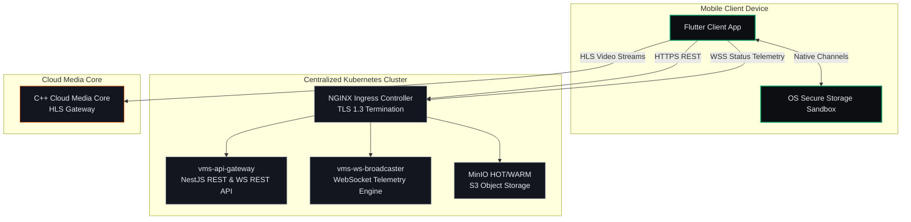

# System Context & Architecture Boundaries (Sagar Mobile Track)

This document establishes the system boundaries, runtime context, multi-tenancy rules, and cross-team interface contracts for the Enterprise VMS cross-platform mobile client (`mobile/`).

---

## 1. System Overarching Context

The mobile application is a high-performance, low-latency B2B client built with Flutter. It is designed to run on Android and iOS devices, communicating with a centralized, cloud-native hosted SaaS infrastructure.

---

## 2. Multi-Tenant Row-Level Isolation (Row-Level Security)

To comply with B2B SaaS security mandates, every single data point must be partitioned by tenant.
*   **Tenant Sharding Key:** `customer_id` (UUIDv4) is the root-level partition parameter.
*   **Composite Primary Keys:** Physical resources (like cameras, edge servers) use composite keys: `(customer_id, site_id, camera_id)`.
*   **Security Rule:** The mobile client is an untrusted environment. Tenancy bounds are determined strictly on the backend by extracting the `customer_id` and site permissions from the cryptographically signed JWT. The client cannot override or request cross-tenant data.

---

## 3. Tech Stack Invariants (Mobile Client)

| Layer | Component | Implementation Rule |
| :--- | :--- | :--- |
| **UI Framework** | Flutter 3.x (Dart 3.x) | Single codebase targeting Android (API 29+) & iOS (iOS 15+). |
| **State Management** | flutter_bloc (v8.1.3+) | Event-driven states mapping logical UI actions. |
| **Network Client** | Dio (v5.4.3+) | Pinned certificate connections with custom `Completer` concurrency queues. |
| **Persistence** | Custom Platform MethodChannels | Direct bridge to iOS Keychain and Android `EncryptedSharedPreferences`. |
| **Static Analysis** | `very_good_analysis` | Strict linter constraints, zero warning metrics accepted. |

---

## 4. Cross-Owner Integration Boundaries

*   **Vivek (Control Plane - NestJS):** Exposes transactional REST endpoints (`/api/v5/auth/login`, `/api/v5/cameras`) and WebSocket status telemetry broadcasts.
*   **Shubham + Saurabh (Media Core & Edge Agent - C++):** Handle RTSP/ONVIF discovery on the edge and convert continuous streams to fMP4 fragments. Expose signed HLS stream endpoints (`.m3u8`) to the mobile player.
*   **Sagar (Mobile Client - Flutter):** Consumes Control Plane REST APIs, maintains live telemetry WebSocket feeds, respects player codec limits (Semaphore count $\le 4$), and renders HLS video grids.
