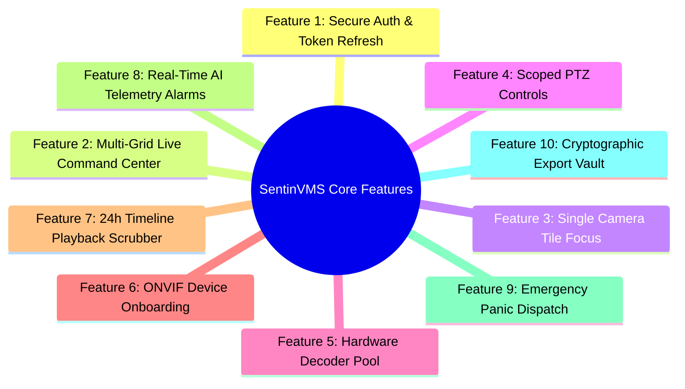
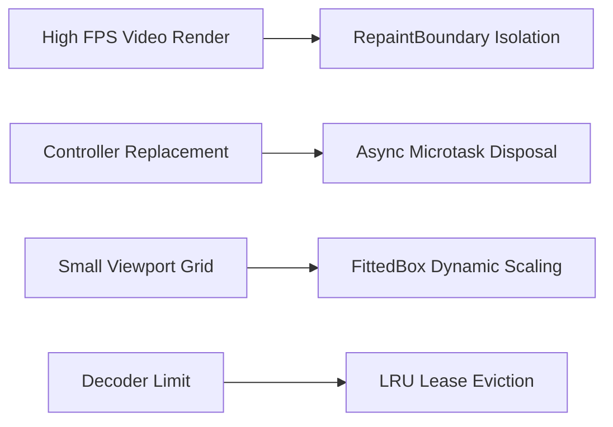
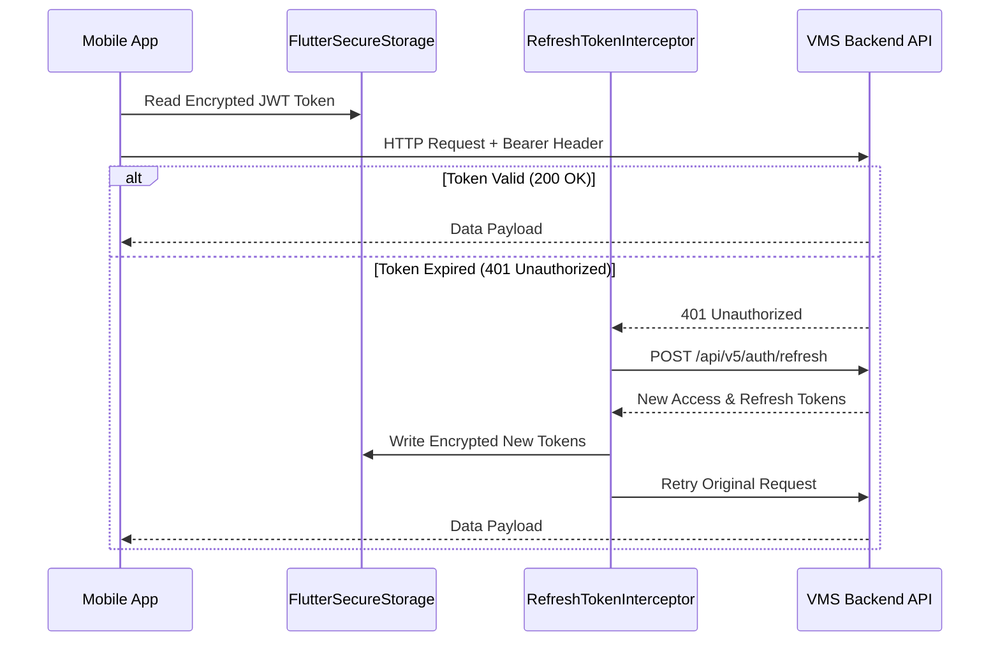
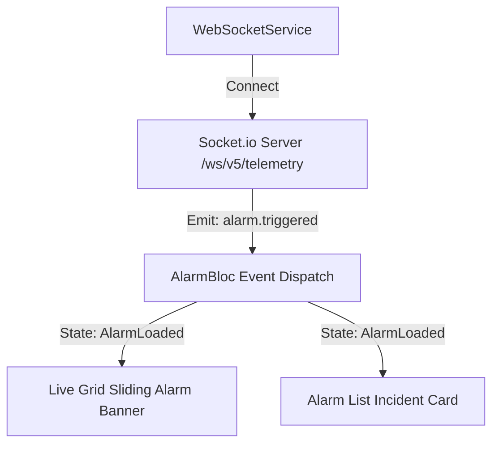

# SentinVMS - Exhaustive Master System Architecture & Technical Handbook

> **Project**: SentinVMS Mobile Client  
> **Version**: 1.0.0 (Phase I Master Release)  
> **Architecture**: Clean Architecture + BLoC + Hardware Decoder Pool  
> **Design System**: Subtle Dark Glassmorphism (`#0F172A` Slate Dark, `#2DD4BF` Electric Teal, `#EF4444` Crimson Red)

---

## 1. Executive Summary

**SentinVMS** is an enterprise-grade Video Management System (VMS) mobile application designed for real-time CCTV camera monitoring, AI-driven threat alerts, hardware-accelerated video decoding, 24-hour timeline scrubbing, emergency panic dispatches, ONVIF device onboarding, and cryptographic evidence exports.

---

## 2. 10 Core Features & Implementation Matrix



### 🔑 Feature 1: Enterprise Authentication & Auto Token Refresh
- **What it is**: Secure login with OTP verification, encrypted token persistence, and background token refresh.
- **Implementation**: [`AuthBloc`](file:///c:/Users/SAGAR/vmsapp/SentinVMS/mobile/lib/core/auth/auth_bloc.dart), [`SecureStorageService`](file:///c:/Users/SAGAR/vmsapp/SentinVMS/mobile/lib/core/auth/secure_storage_service.dart), [`RefreshTokenInterceptor`](file:///c:/Users/SAGAR/vmsapp/SentinVMS/mobile/lib/core/network/refresh_token_interceptor.dart). Handles HTTP `401` transparently.

### 🎛️ Feature 2: Dynamic Multi-Grid Live Command Center (`1x1`, `2x2`, `3x3`, `4x4`)
- **What it is**: High-density CCTV live streaming layout supporting 1, 4, 9, and 16 camera grid viewports with zero-gap tile placement.
- **Implementation**: [`LiveGridPage`](file:///c:/Users/SAGAR/vmsapp/SentinVMS/mobile/lib/features/live_view/live_grid_page.dart). Grid cycler badge toggles densities `[1]`, `[4]`, `[9]`, `[16]`.

### 🔍 Feature 3: Single Camera Screen Focus & Auto-Transition on Tap
- **What it is**: Tapping any assigned camera tile in a multi-camera grid immediately expands that stream into 1x1 Single View focus mode.
- **Implementation**: `_buildGridSlot(int index)` gesture handler in [`live_grid_page.dart`](file:///c:/Users/SAGAR/vmsapp/SentinVMS/mobile/lib/features/live_view/live_grid_page.dart#L545) updating `_layoutGridSize = 1`.

### 🕹️ Feature 4: Scoped PTZ (Pan-Tilt-Zoom) Camera Controls
- **What it is**: Directional D-pad and Zoom controls for pan, tilt, and zoom adjustment, hidden on multi-grids to avoid clutter and active only in Single View mode.
- **Implementation**: [`VideoTile`](file:///c:/Users/SAGAR/vmsapp/SentinVMS/mobile/lib/features/live_view/widgets/video_tile.dart) accepts `showPtzOverlay: _layoutGridSize == 1 && _isPTZActive`.

### ⚡ Feature 5: Mobile Hardware Decoder Pool (`DecoderPool`)
- **What it is**: LRU hardware decoder lease and eviction manager for mobile GPU/CPU decoders.
- **Implementation**: [`DecoderPool`](file:///c:/Users/SAGAR/vmsapp/SentinVMS/mobile/lib/core/video/decoder_pool.dart) allocates `DecoderLease` and triggers UI pause/resume callbacks.

### 📡 Feature 6: ONVIF Auto-Discovery & Quick Device Onboarding
- **What it is**: Subnet ONVIF scan, QR/barcode scanner, and manual IP entry with a clean `+` quick action button on the Live Grid bar.
- **Implementation**: [`DeviceCategoryPage`](file:///c:/Users/SAGAR/vmsapp/SentinVMS/mobile/lib/features/device_onboarding/presentation/device_category_page.dart), [`ScannerView`](file:///c:/Users/SAGAR/vmsapp/SentinVMS/mobile/lib/features/device_onboarding/presentation/widgets/scanner_view.dart), and `+` IconButton.

### ⏱️ Feature 7: Interactive 24-Hour Timeline Playback Scrubber (`/playback`)
- **What it is**: Recorded footage playback with a gesture-based 24-hour timeline scrubber, color-coded event segments, variable speed control (`0.5x` to `16.0x`), and frame snapshots.
- **Implementation**: [`TimelineScrubber`](file:///c:/Users/SAGAR/vmsapp/SentinVMS/mobile/lib/features/playback/widgets/timeline_scrubber.dart) and [`PlaybackPage`](file:///c:/Users/SAGAR/vmsapp/SentinVMS/mobile/lib/features/playback/presentation/playback_page.dart).

### 🚨 Feature 8: Real-Time AI Telemetry Alarms & Socket.io Sync (`/alarms`)
- **What it is**: Instant push notification and list rendering of incoming AI analytics threats (`INTRUSION`, `FIRE`, `LOITERING`, `VANDALISM`) with acknowledgment workflows.
- **Implementation**: [`AlarmBloc`](file:///c:/Users/SAGAR/vmsapp/SentinVMS/mobile/lib/features/alarms/bloc/alarm_bloc.dart), [`WebSocketService`](file:///c:/Users/SAGAR/vmsapp/SentinVMS/mobile/lib/core/network/websocket_service.dart), and [`AlarmListPage`](file:///c:/Users/SAGAR/vmsapp/SentinVMS/mobile/lib/features/alarms/presentation/alarm_list_page.dart).

### ⚠️ Feature 9: Emergency Panic Alert & Control Room Dispatch
- **What it is**: One-touch emergency protocol dispatcher with a 5-second cancelable overlay for Siren and Control Room alarm triggers.
- **Implementation**: `_showPanicDialog()` & `_startPanicCountdown()` in [`live_grid_page.dart`](file:///c:/Users/SAGAR/vmsapp/SentinVMS/mobile/lib/features/live_view/live_grid_page.dart#L198).

### 📦 Feature 10: Cryptographic Export Vault & Offline Connectivity Banner
- **What it is**: Time-bound video clip export with cryptographic SHA-256 watermark verification, progress polling, and offline banner notification.
- **Implementation**: [`ExportPage`](file:///c:/Users/SAGAR/vmsapp/SentinVMS/mobile/lib/features/export/presentation/export_page.dart) and [`ConnectivityBanner`](file:///c:/Users/SAGAR/vmsapp/SentinVMS/mobile/lib/core/widgets/connectivity_banner.dart).

---

## 3. Backend System Ecosystem Interaction Architecture

SentinVMS Mobile App operates as a client within a 4-component backend ecosystem:

```mermaid
graph TD
    App[SentinVMS Mobile App]

    subgraph Cloud Server Infrastructure
        API[VMS Backend API Gateway - REST / HTTPS]
        DB[(PostgreSQL DB & Redis Cache)]
        AI[AI Threat Analytics Engine]
    end

    subgraph Media Infrastructure
        MediaCore[MediaCore Server - HLS / RTSP Streaming Engine]
    end

    subgraph Edge On-Premise Infrastructure
        EdgeAgent[EdgeAgent Gateway - Local ONVIF Discovery & Subnet Agent]
        Cameras[CCTV Cameras - ONVIF / RTSP Feeds]
    end

    App -->|1. REST HTTPS API / Auth / Metadata| API
    API -->|Read / Write State| DB
    App -->|2. Request Stream Auth Token| API
    API-->>App: Signed HLS Playlist Token
    App -->|3. Fetch HLS .m3u8 Video Segments| MediaCore
    EdgeAgent -->|4. Ingest & Transcode Feeds| MediaCore
    Cameras -->|ONVIF / RTSP Stream| EdgeAgent
    App -->|5. UDP Subnet Scan / ONVIF WS-Discovery| EdgeAgent
    AI -->|6. Real-time Threat Push / Socket.io| App
```

### Component Interaction & Protocol Matrix

| Backend Component | Communication Protocol | Mobile App Interaction Purpose | Key Data Handled |
| :--- | :--- | :--- | :--- |
| **Backend API Gateway** | HTTPS / REST (JSON) | User Authentication, Site Hierarchies, Camera Metadata, Export Requests, Alarm ACK | JWT Tokens, Camera Configs, Segment Timelines, Export Job Status |
| **PostgreSQL & Redis DB** | Indirect via API | Managed by Backend API for relational data & volatile session caching | User Profiles, Site Tree, Audit Logs, Active Session Keys |
| **MediaCore Server** | HLS (HTTP `.m3u8` & `.ts`) / RTSP | Low-latency live video streaming and 24-hour historical playback stream rendering | HLS Video Segments, Signed Stream Tokens |
| **EdgeAgent Gateway** | UDP Broadcast / HTTP ONVIF WS-Discovery | Subnet camera auto-discovery, local IP scanning, and PTZ command relay | Camera IP Addresses, ONVIF Profiles, Local RTSP URLs |
| **AI Threat Analytics Engine** | Socket.io WebSockets (`/ws/v5/telemetry`) | Push real-time intrusion, fire, and threat detection events directly to the mobile UI | Threat Type, Bounding Box Coordinates, Snapshot Frame URLs |

---

## 4. Deep-Dive: System Performance & Memory Optimizations

Mobile surveillance applications process high-bandwidth video streams. SentinVMS employs 4 critical performance optimizations:



1. **RepaintBoundary Texture Isolation**:
   - Each [`VideoTile`](file:///c:/Users/SAGAR/vmsapp/SentinVMS/mobile/lib/features/live_view/widgets/video_tile.dart#L153) wraps its video content inside a `RepaintBoundary`. This prevents video frame repaints (24-60 FPS) from triggering layout invalidation on parent grid widgets.
2. **Asynchronous Controller Disposal**:
   - When switching stream URLs in `PlaybackPage`, old video controllers are disposed via `scheduleMicrotask(oldController.dispose)` to prevent UI thread stuttering during video channel switches.
3. **Responsive `FittedBox` Layout Scaling**:
   - In 9-camera (`3x3`) and 16-camera (`4x4`) grids, stream error and eviction messages wrap in `FittedBox(fit: BoxFit.scaleDown)` to guarantee zero `RenderFlex overflow` exceptions.
4. **Custom User-Agent Injection**:
   - Passes custom HTTP headers (`User-Agent: Mozilla/5.0...`) to `VideoPlayerController.networkUrl` to prevent Android ExoPlayer `403 Forbidden` errors from CDN/GCS media servers.

---

## 5. Security & Cryptography Architecture



- **Encrypted Storage**: Credentials and refresh tokens are stored in hardware-backed KeyStore (Android) and Keychain (iOS).
- **Tenant Isolation**: Non-admin requests automatically attach tenant sharding scopes (`customer_id`).
- **Watermark Verification**: Exported video clips embed SHA-256 cryptographic hashes for tamper-proof legal admissibility.

---

## 6. Real-Time Telemetry & Socket.io WebSockets

SentinVMS establishes a persistent WebSocket connection to the VMS Broadcaster:



- **Broadcaster Endpoint**: `/ws/v5/telemetry`
- **Events Subscribed**: `alarm.triggered`, `camera.status_changed`, `export.job_completed`.

---

## 7. UI Design System (Subtle Dark Glassmorphism)

All UI elements adhere strictly to project design tokens in [`.agents/AGENTS.md`](file:///c:/Users/SAGAR/vmsapp/SentinVMS/.agents/AGENTS.md):

- 🌌 **Base Canvas**: Ultra Dark Slate (`#0F172A`)
- 💎 **Translucent Glass Panels**: `BackdropFilter(sigmaX: 8-12, sigmaY: 8-12)` with low opacity (`0.04`–`0.08`)
- ⚡ **Primary Accent**: Subtle Electric Teal (`#2DD4BF`)
- 🚨 **Emergency Accent**: Crimson Red (`#EF4444`)
- 🩶 **Captions**: Slate Grey (`#94A3B8`)

---

## 8. Directory Structure & Key Files Index

```
mobile/lib/
├── app/
│   ├── app.dart                    # App Entry Root & Theme Setup
│   └── router.dart                 # GoRouter Declarative Routing
├── core/
│   ├── auth/                       # AuthBloc & Token Handling
│   ├── network/                    # Dio Interceptors & WebSocket Service
│   ├── video/
│   │   └── decoder_pool.dart       # Hardware Decoder Pool Manager
│   └── widgets/
│       ├── vms_drawer.dart         # Global Glassmorphic Drawer
│       └── connectivity_banner.dart# Offline Status Banner
└── features/
    ├── alarms/                     # AI Alarm List & Telemetry BLoC
    ├── camera/                     # Camera Repository & List View
    ├── device_onboarding/          # ONVIF Auto-Discovery & Manual Form
    ├── export/                     # Video Export Vault & Watermark
    ├── live_view/                  # Live Grid Page & Video Tile
    ├── login/                      # Login & OTP Verification Pages
    └── playback/                   # Timeline Scrubber & HLS Player
```

---

## 9. Build, Test & Deployment Verification

### 9.1 Automated Testing
```bash
cd mobile
flutter test test/widget/live_grid_page_test.dart test/widget/video_tile_test.dart
```

### 9.2 Code Analysis
```bash
flutter analyze
```

### 9.3 APK Compilation
```bash
flutter build apk --debug
```
**Compiled Output Location**:  
[`app-debug.apk`](file:///c:/Users/SAGAR/vmsapp/SentinVMS/mobile/build/app/outputs/flutter-apk/app-debug.apk)
