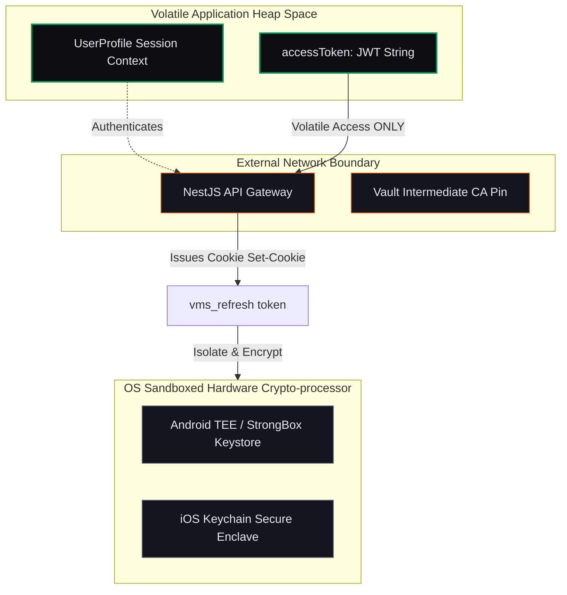

# Context & Security Boundaries — Micro-Phase A: Security, Auth & Storage

This document defines the architectural context, trust boundaries, and platform-specific invariants for **Micro-Phase A: Security, Auth & Storage (Foundation)**.

---

## 1. Security Context & Trust Zones

Micro-Phase A establishes the secure gateway and credentials quarantine zones. Data is strictly separated between volatile, short-lived session components and persistent, hardware-locked tokens.

---

## 2. Platform Security Constraints (F09)

*   **Android (API 29+):** The refresh token must be stored inside `EncryptedSharedPreferences` backed by the Android Keystore. Keys are encrypted with AES-256-GCM, and the master key is generated via the hardware cryptoprocessor.
*   **iOS (iOS 15+):** The refresh token is saved using the iOS Keychain Service API. Key attributes are locked to `kSecAttrAccessibleWhenUnlockedThisDeviceOnly`, which explicitly prevents iCloud backup synchronization or retrieval when the device is locked.

---

## 3. Network Transport Constraints (F10)

*   **SPKI Leaf-Pinning Banned:** We pin the connection against the base64-encoded SHA-256 fingerprint of the Intermediate CA (Vault). We do *not* pin against leaf certificates to prevent system failure during certificate rotation.
*   **Development Bypass:** To avoid blocking local builds on local emulators (which use self-signed certs), the app supports the compile-time compiler argument:
    `flutter run --dart-define=BYPASS_PINNING=true`
    In production releases, this flag must remain `false`.

---

## 4. Concurrency Guard (RefreshLock)

*   Multiple concurrent video requests can fail with an HTTP 401 status simultaneously.
*   The `RefreshTokenInterceptor` forces subsequent requests to wait on a single `Completer` block, preventing overlapping token refresh cycles and invalidating rotated refresh credentials.
