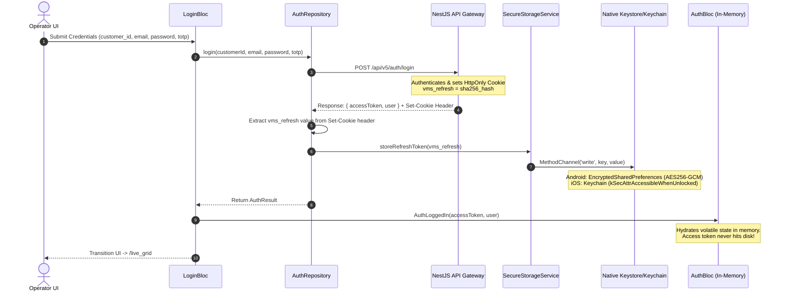
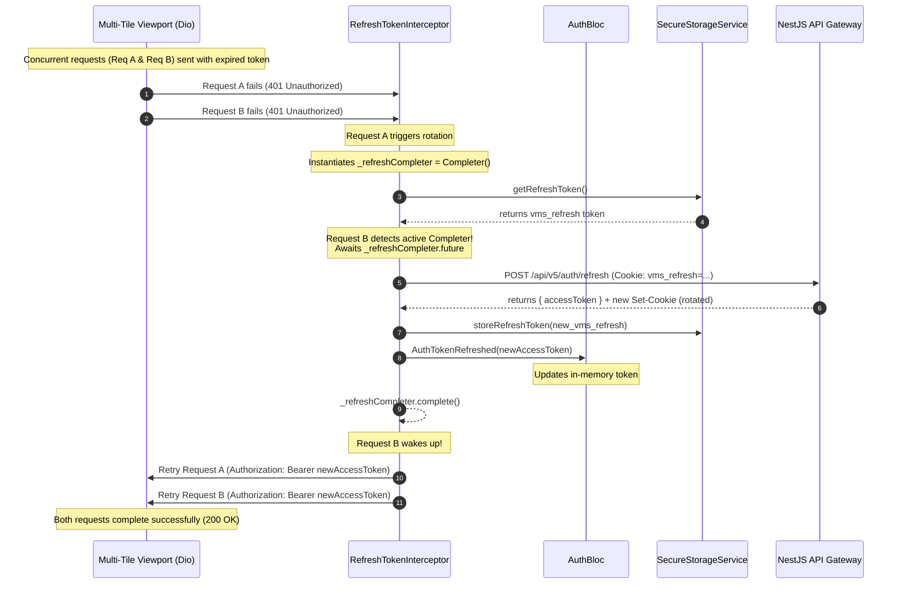
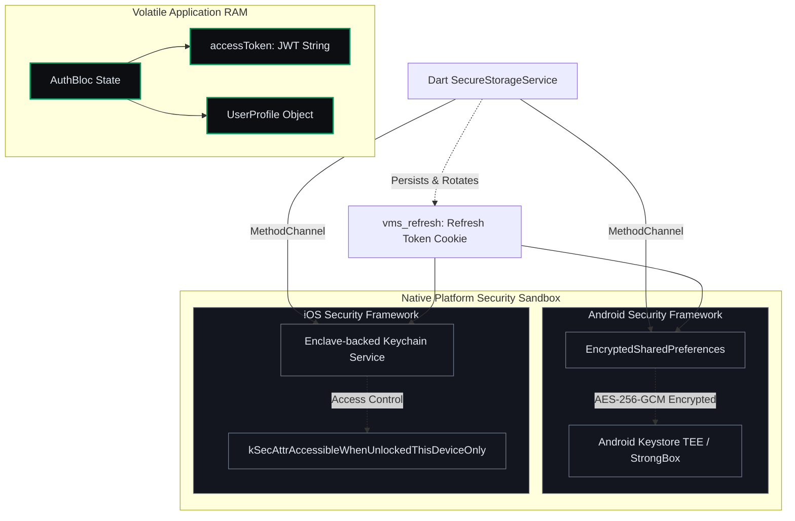

# Mobile Client — Micro-Phase A: Security, Auth & Storage

This document details the visual architectural specifications, implementation decisions, and code files created for **Micro-Phase A: Security, Auth & Storage (Foundation)**.

---

## 1. Approved Architectural Decisions

*   **Native Cryptoprocessors Storage (F09):** The sensitive `vms_refresh` token is persisted strictly inside hardware-backed storage (iOS Keychain utilizing `kSecAttrAccessibleWhenUnlockedThisDeviceOnly`; Android Keystore utilizing `EncryptedSharedPreferences`).
*   **Transient Access Tokens:** The short-lived `accessToken` is stored strictly in volatile RAM (the heap space of `AuthBloc`). It is never written to disk.
*   **Intermediate CA SPKI Pinning (F10):** The `Dio` HTTP adapter pins connection trust to the HashiCorp Vault Intermediate CA certificate's public key hash (base64 SHA-256 SPKI), rejecting rogue certificates. A compile-time bypass flag (`--dart-define=BYPASS_PINNING=true`) is available for local emulators.
*   **Concurrent RefreshLock interceptor:** Fired concurrent requests waiting on 401 errors are paused using a single `Completer<void>? _refreshCompleter` lock queue, executing exactly one `/api/v5/auth/refresh` request and retrying when resolved.

---

## 2. Sequence Diagram: Authentication Lifecycle

Demonstrates the flow of credential submission down to NestJS Gateway, cookie extraction, and native MethodChannel storage partition.

---

## 3. Sequence Diagram: Concurrent Token Rotation (RefreshLock)

Demonstrates how the `Completer` gate handles multiple concurrent HTTP calls when the token expires.

---

## 4. Block Diagram: Volatile RAM vs. OS Sandboxing

---

## 5. Implementation File References

*   **Security Methods Bridge:** [secure_storage_service.dart](file:///c:/Users/Sagar%20Agnihotri/OneDrive/Desktop/saasvms/mobile/lib/core/storage/secure_storage_service.dart)
*   **CA Pinning & HttpClient Adapter:** [dio_factory.dart](file:///c:/Users/Sagar%20Agnihotri/OneDrive/Desktop/saasvms/mobile/lib/core/network/dio_factory.dart)
*   **Rotation Interceptor:** [refresh_token_interceptor.dart](file:///c:/Users/Sagar%20Agnihotri/OneDrive/Desktop/saasvms/mobile/lib/core/network/refresh_token_interceptor.dart)
*   **Transient State Handler:** [auth_bloc.dart](file:///c:/Users/Sagar%20Agnihotri/OneDrive/Desktop/saasvms/mobile/lib/core/auth/auth_bloc.dart)
*   **Form Login Page Layout:** [login_page.dart](file:///c:/Users/Sagar%20Agnihotri/OneDrive/Desktop/saasvms/mobile/lib/features/login/login_page.dart)
