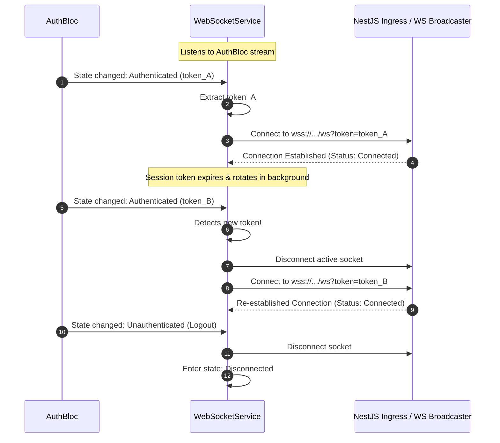
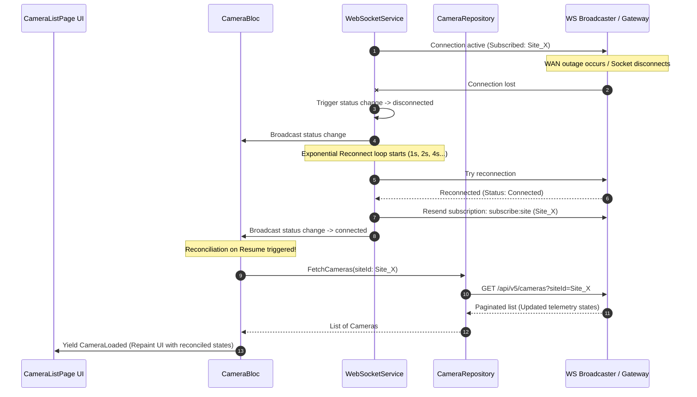
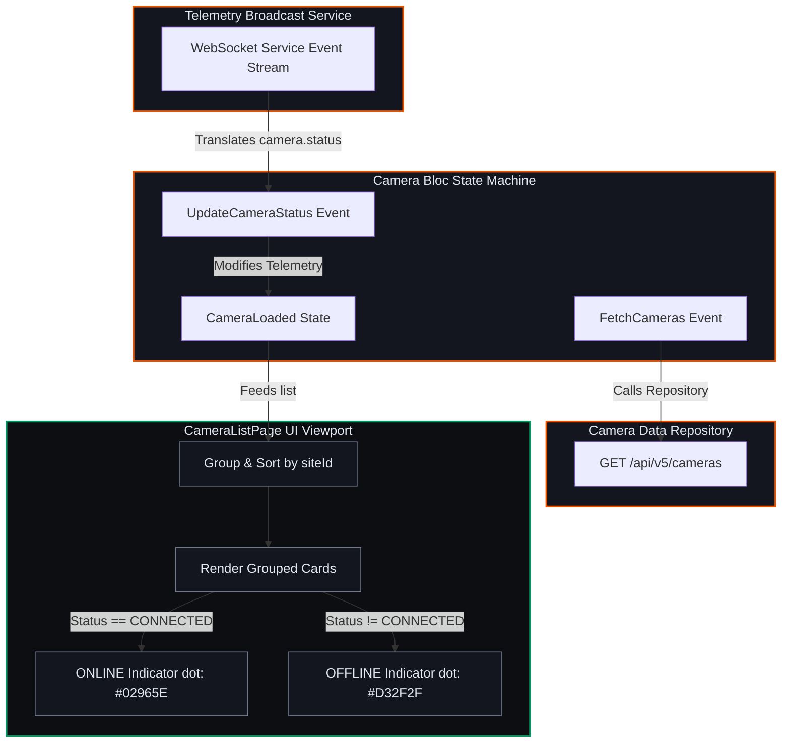

# Mobile Client — Micro-Phase B: Camera Registry & Status Telemetry

This document details the architectural specifications, sequence flows, and implementation reference mappings for **Micro-Phase B: Camera Registry & Status Telemetry (Metadata)**.

---

## 1. Approved Architectural Decisions

*   **WebSocket State Mapping:** A single [WebSocketService](file:///c:/Users/Sagar%20Agnihotri/OneDrive/Desktop/saasvms/mobile/lib/core/network/websocket_service.dart) runs as a singleton in the dependency injector. It monitors the state of `AuthBloc`:
    *   Initiates connection when user logs in (`Authenticated` state).
    *   Disconnects socket when user logs out (`Unauthenticated` state).
    *   Reconnects using the brand new token when the interceptor executes a refresh rotation (token changes inside `Authenticated` state).
*   **Reconnection Telemetry Reconciliation:** If the connection drops, the service reconnects using exponential backoff (capped at 30 seconds). To prevent missing status update packets during connection downtime, the [CameraBloc](file:///c:/Users/Sagar%20Agnihotri/OneDrive/Desktop/saasvms/mobile/lib/features/camera/bloc/camera_bloc.dart) intercepts the socket status transitioning back to `connected` and triggers **Reconciliation on Resume** by calling `GET /api/v5/cameras` again.
*   **Site-Level Subscription:** Active camera updates are restricted by site. When fetching cameras for a specific `siteId`, the app writes a subscription payload onto the socket: `{ "event": "subscribe:site", "data": { "siteId": siteId } }`. The service stores these active subscriptions and resubscribes automatically upon connection restoration.

---

## 2. Sequence Diagram: WebSocket Auth Synchronization Flow

Demonstrates how the WebSocket connection handles logins, logouts, and token rotation updates dynamically.

---

## 3. Sequence Diagram: Reconnection Telemetry Reconciliation

Demonstrates how the client handles network dropouts and prevents stale online/offline UI statuses.

---

## 4. Block Diagram: Camera Domain Structure & Site Grouping

---

## 5. Implementation File References

*   **Camera Model:** [camera_model.dart](file:///c:/Users/Sagar%20Agnihotri/OneDrive/Desktop/saasvms/mobile/lib/features/camera/models/camera_model.dart)
*   **REST Repository Client:** [camera_repository.dart](file:///c:/Users/Sagar%20Agnihotri/OneDrive/Desktop/saasvms/mobile/lib/features/camera/data/camera_repository.dart)
*   **WebSocket Broadcast Service:** [websocket_service.dart](file:///c:/Users/Sagar%20Agnihotri/OneDrive/Desktop/saasvms/mobile/lib/core/network/websocket_service.dart)
*   **Camera Directory State Bloc:** [camera_bloc.dart](file:///c:/Users/Sagar%20Agnihotri/OneDrive/Desktop/saasvms/mobile/lib/features/camera/bloc/camera_bloc.dart)
*   **Directory Viewport Layout:** [camera_list_page.dart](file:///c:/Users/Sagar%20Agnihotri/OneDrive/Desktop/saasvms/mobile/lib/features/camera/presentation/camera_list_page.dart)
