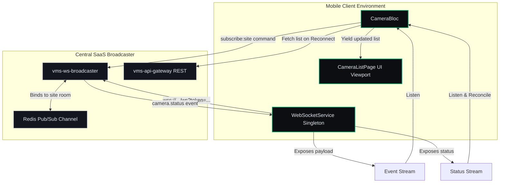

# Context & Telemetry Boundaries — Micro-Phase B: Camera Registry & Status Telemetry

This document defines the architectural context, real-time boundaries, and connection state invariants for **Micro-Phase B: Camera Registry & Status Telemetry (Metadata)**.

---

## 1. Real-Time Telemetry Context

Micro-Phase B establishes the real-time event pipeline linking the mobile UI viewport to the NestJS WebSocket Broadcaster service. Heartbeats and camera statuses are consumed asynchronously in the foreground.

---

## 2. Telemetry Synchronization Boundaries (F08)

*   **Active Subscriptions Room Gating:** Telemetry updates are not broadcast globally. To consume status heartbeats, the client must explicitly subscribe to a site room:
    `{ "event": "subscribe:site", "data": { "siteId": "site-uuid" } }`
*   **Active Directory Grouping:** Cameras are dynamically parsed and sorted by `siteId` on the mobile viewport. When a camera status event (`camera.status`) matches an item in the directory, its state changes immediately (Online: `#02965E` / Offline: `#D32F2F`).

---

## 3. Teleconnection Resilience & Reconciliation

*   **Exponential Backoff Retry:** If the WebSocket connection fails (due to a WAN dropout, device locking, or network transition), the client retries connection using exponential backoff:
    $$\text{Backoff Delay} = \min(2^{\text{attempts}}, 30)\text{ seconds}$$
*   **Reconciliation on Resume:** Real-time event broadcasts are ephemeral and not queued by the server during connection downtime. Upon socket state recovery (transitioning back to `connected`), the client immediately triggers a REST fetch (`GET /api/v5/cameras`) to reconcile any statuses missed during the dropout.

---

## 4. Authentication Lifecycle Sync

*   The WebSocket connection query string relies on the transient token: `?token={accessToken}`.
*   If the token rotates in the background, the `WebSocketService` must immediately terminate the current socket and reconnect using the new credentials to prevent server-side authentication drops.
