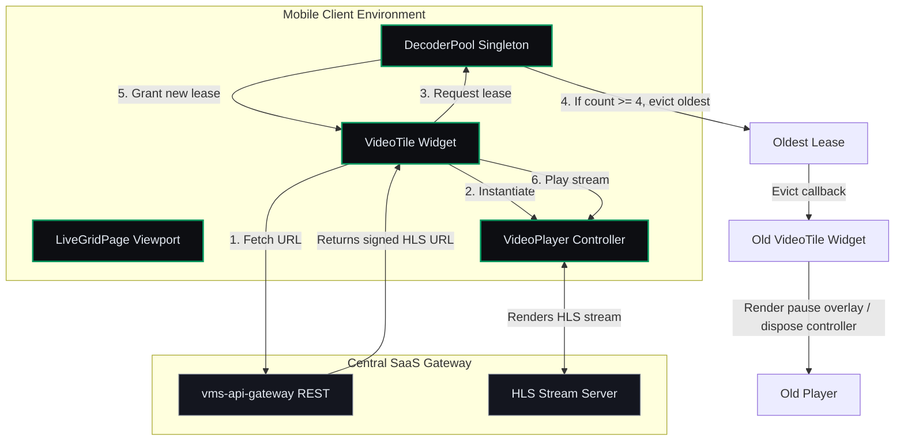

# Context & Video Rendering Boundaries — Micro-Phase C: Live Grid & Decoder Semaphore

This document defines the architectural context, rendering boundaries, and hardware decoder semaphore invariants for **Micro-Phase C: Live Grid & Decoder Semaphore (Video Rendering)**.

---

## 1. Video Rendering & Semaphore Context

Micro-Phase C establishes the video rendering pipeline on the mobile client. Live streams are rendered using HLS (via `VideoPlayerController`). To prevent system resource exhaustion (starvation of hardware H.264/H.265 decoders, causing crashes), we gate active streams through a thread-safe `DecoderPool` semaphore capped at 4.

---

## 2. Hardware Decoder Semaphore Gating (F09)

*   **Decoder Capacity Limit:** The pool is strictly capped at $N = 4$ concurrent active decoders:
    $$\text{Active Leases} \le 4$$
*   **FIFO Lease Eviction:** When a 5th video player attempts to initialize playback, the pool automatically retrieves the oldest lease in the queue, calls `evict()` (which updates the UI to an "Evicted/Paused" state), disposes its controller, and inserts the new lease at the end of the queue.

---

## 3. Repaint Boundary Isolation

Live HLS feeds trigger frame updates at a high rate (e.g., 30 FPS). Without isolation, these updates would trigger repaint passes on parent views (like layout grid, navigation bars, and tabs), causing frame rate drops (layout thrashing) and high CPU load. To prevent this, each `VideoTile` widget wraps its video viewport directly inside a `RepaintBoundary` to construct an isolated display list repaint layer.
