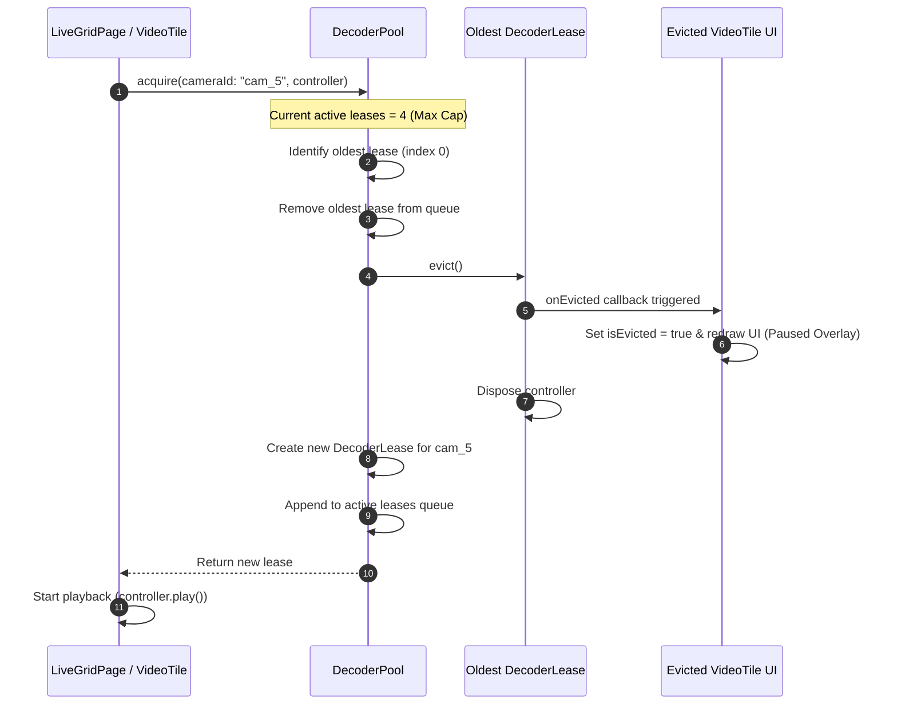
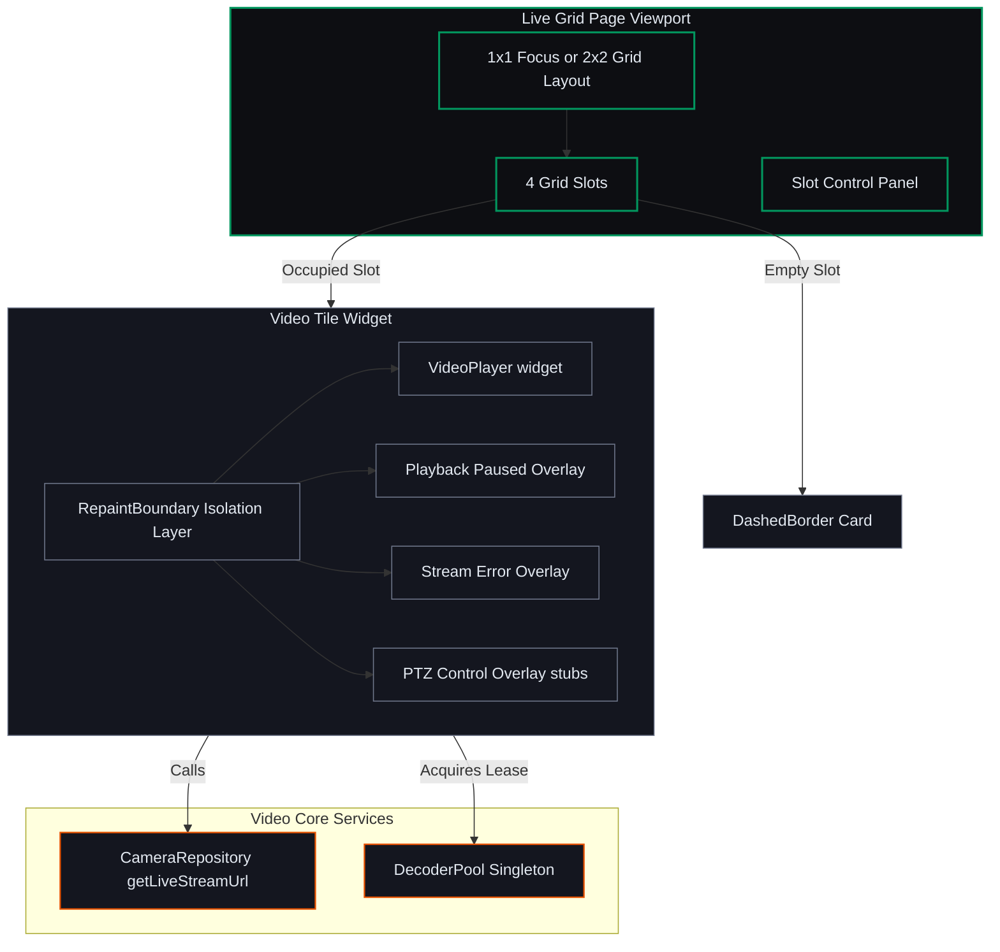

# Mobile Client — Micro-Phase C: Live Grid & Decoder Semaphore

This document details the architectural specifications, sequence flows, and implementation reference mappings for **Micro-Phase C: Live Grid & Decoder Semaphore (Video Rendering)**.

---

## 1. Approved Architectural Decisions

*   **Decoder Pool Limits:** To prevent system starvation of hardware H.264/H.265 video decoders on mobile operating systems, the client restricts the number of active video controllers to 4. Any attempt to initialize a 5th video player triggers an eviction callback that pauses and disposes the oldest controller.
*   **Repaint boundaries:** Live HLS players update their frames continuously. Wrapping the player tree in `RepaintBoundary` prevents constant repaint propagation up the widget tree, preserving smooth scrolling and UI interaction speeds.
*   **Matte Dark Industrial Theme:** Responsive 1x1 (single channel focus) and 2x2 (4 concurrent feeds) grid layouts with dark slot overlays (`Color(0xFF14161F)`) and dashed borders using a custom painter.

---

## 2. Sequence Diagram: Decoder Lease Allocation & FIFO Eviction Flow

Demonstrates the lifecycle of acquiring a lease, showing how a 5th request triggers an automatic eviction of the oldest stream.

---

## 3. Block Diagram: Rendering Architecture

---

## 4. Implementation File References

*   **Decoder Semaphore Pool:** [decoder_pool.dart](file:///c:/Users/Sagar%20Agnihotri/OneDrive/Desktop/saasvms/mobile/lib/core/video/decoder_pool.dart)
*   **Live Grid Viewport:** [live_grid_page.dart](file:///c:/Users/Sagar%20Agnihotri/OneDrive/Desktop/saasvms/mobile/lib/features/live_view/live_grid_page.dart)
*   **Video Tile Widget:** [video_tile.dart](file:///c:/Users/Sagar%20Agnihotri/OneDrive/Desktop/saasvms/mobile/lib/features/live_view/widgets/video_tile.dart)
*   **Router Mapping:** [router.dart](file:///c:/Users/Sagar%20Agnihotri/OneDrive/Desktop/saasvms/mobile/lib/app/router.dart)
*   **Decoder Pool Tests:** [decoder_pool_test.dart](file:///c:/Users/Sagar%20Agnihotri/OneDrive/Desktop/saasvms/mobile/test/unit/decoder_pool_test.dart)
*   **Video Tile Widget Tests:** [video_tile_test.dart](file:///c:/Users/Sagar%20Agnihotri/OneDrive/Desktop/saasvms/mobile/test/widget/video_tile_test.dart)
*   **Live Grid Page Widget Tests:** [live_grid_page_test.dart](file:///c:/Users/Sagar%20Agnihotri/OneDrive/Desktop/saasvms/mobile/test/widget/live_grid_page_test.dart)
