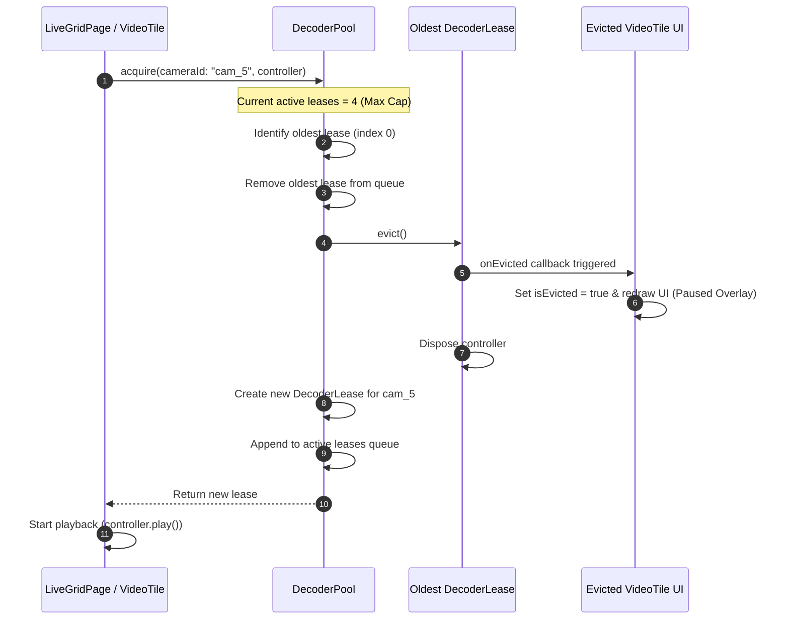
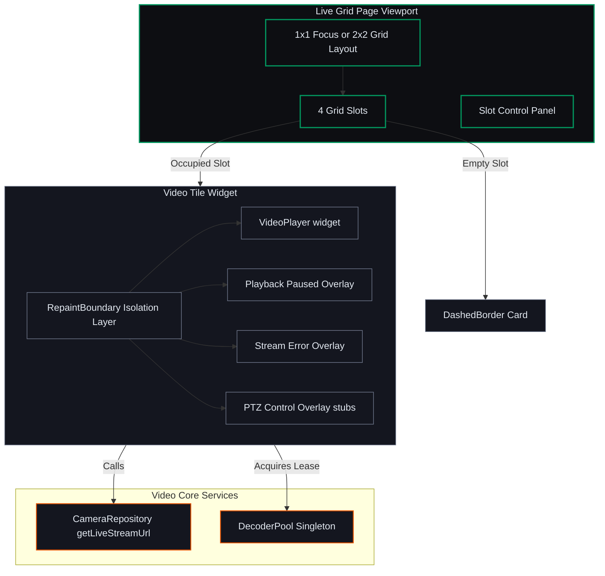

# Phase C: Mermaid Diagrams (Live Grid & Decoder Semaphore)

This document contains the raw Mermaid diagram source code for **Micro-Phase C: Live Grid & Decoder Semaphore (Video Rendering)**.

---

## 1. Sequence Diagram: Decoder Lease Allocation & FIFO Eviction Flow

---

## 2. Block Diagram: Rendering Architecture

