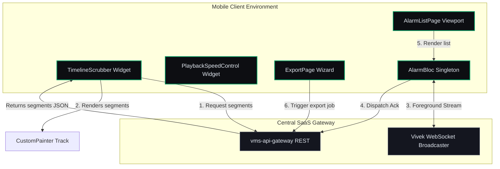

# Context & Operations Boundaries — Micro-Phase D: Timeline Playback, Alarms & Exports

This document defines the architectural context, operations boundaries, and real-time synchronization invariants for **Micro-Phase D: Timeline Playback, Alarms & Exports (Operations)**.

---

## 1. Timeline Scrubber & Playback Context

Micro-Phase D implements operational controls for timeline playback of recorded footage, real-time AI alarms, and video export management.

---

## 2. Color-Coded Timeline Representation (F05)

Recording segments on the timeline are represented visually based on their type classification:
*   **Continuous:** `#1565C0` (Blue)
*   **Motion:** `#E65100` (Orange)
*   **Scheduled:** `#02965E` (Green)

The timeline track calculates horizontal coordinates by projecting segments from $t_{\text{start}}$ to $t_{\text{end}}$ onto the 24-hour horizontal space using time-to-offset mapping:
$$X = \text{Padding} + \frac{t - t_{\text{day\_start}}}{86400} \times \text{TrackWidth}$$

---

## 3. Real-time Alarm Ingestion (F08)

The client subscribes to foreground WebSocket events from Vivek's broadcaster. When the app is in the background, FCM messages deliver notification payloads. The `AlarmBloc` reconciles state on resume by fetching the alarm log (`GET /api/v5/alarms`), preventing telemetry loss.
