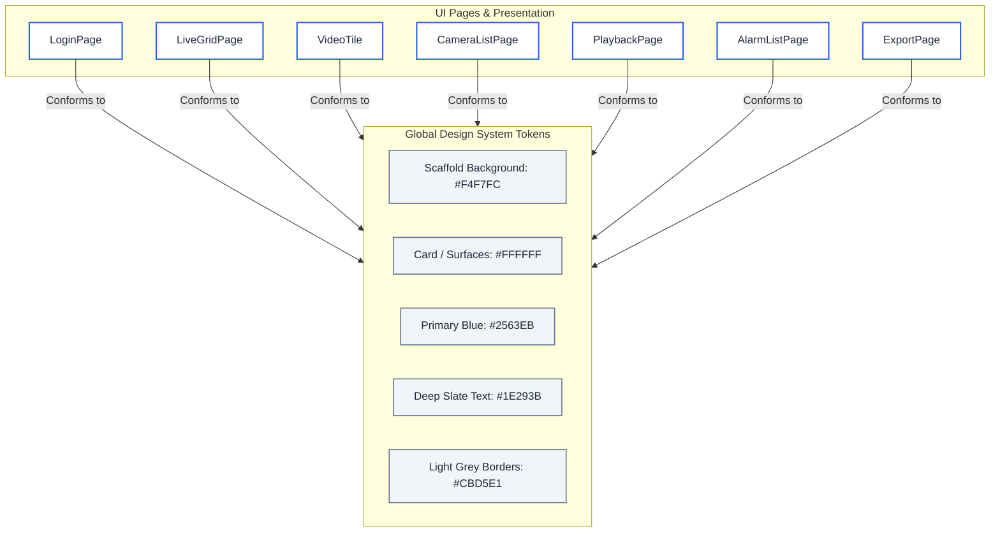

# Context & Boundaries — Premium Modern Light-Theme Redesign (Phase D.6)

This document defines the architectural context, design tokens, and performance boundaries for the **Premium Modern Light-Theme Redesign (Phase D.6)**.

---

## 1. UI Redesign Context

This sub-phase focuses on transitioning the visual identity of the VMS client from a dark tactical cockpit HUD to a clean, premium, modern light-theme smart-home/enterprise camera dashboard.

---

## 2. Visual Style Guidelines & Tokens

The redesign implements a modern, cohesive enterprise light theme based on the following tokens:

*   **Primary Scaffold Background:** `#F4F7FC` (soft blue-grey tint)
*   **Card / Surface Background:** `#FFFFFF` (pure solid white with subtle shadow depth)
*   **Secondary Surface Background:** `#F1F5F9` / `#F8FAFC` (light grey highlight surfaces)
*   **Primary Brand Blue Accent:** `#2563EB` (vibrant indigo-blue for primary buttons, selected tabs, active borders, and highlights)
*   **Primary Text:** `#1E293B` (deep slate charcoal for titles and headings)
*   **Secondary Label Text:** `#64748B` (slate grey for secondary text and hints)
*   **Borders:** `#CBD5E1` / `#E2E8F0` (thin grey borders for inputs and divisions)
*   **Continuous Video Segments:** `#3B82F6` (pastel blue)
*   **Motion Video Segments:** `#F59E0B` (pastel amber)
*   **Scheduled Video Segments:** `#10B981` (pastel emerald green)
*   **Critical Alerts / Offline State:** `#EF4444` (modern soft crimson red)
*   **Success Status / Online State:** `#10B981` (soft emerald green)

---

## 3. Operations & Performance Boundaries

1. **Card Layouts and Shadows:** We employ low-elevation drop shadows (`blurRadius: 4.0`, offset `Offset(0, 2)`) to create depth without bloating draw call counts.
2. **Repaint Boundary Isolation:** We continue to isolate heavy camera renders (`RepaintBoundary`) to ensure viewport overlays and control panels do not trigger full screen paint cycles on frame ticks.
3. **PTZ Control Simplification:** Redesigned the PTZ controller into a lightweight stacked circular layout using flat vector shapes. This avoids image texture loading and reduces runtime memory overhead.
4. **Clean Ink Splashes:** Wrapped all custom list items in transparent `Material` widgets to support native platform ink ripples without interfering with the decorated white container boxes.
