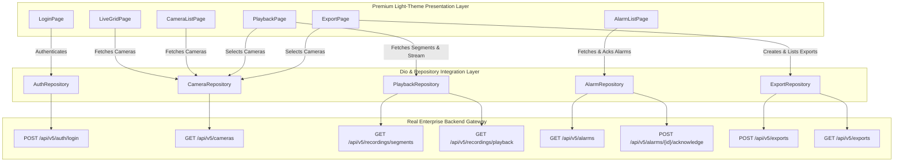

```mermaid
graph TD
    subgraph UI_Layer [Premium Light-Theme Presentation Layer]
        LoginPage[LoginPage]
        LiveGridPage[LiveGridPage]
        CameraListPage[CameraListPage]
        PlaybackPage[PlaybackPage]
        AlarmListPage[AlarmListPage]
        ExportPage[ExportPage]
    end

    subgraph Data_Layer [Dio & Repository Integration Layer]
        AuthRepo[AuthRepository]
        CamRepo[CameraRepository]
        PlaybackRepo[PlaybackRepository]
        AlarmRepo[AlarmRepository]
        ExportRepo[ExportRepository]
    end

    subgraph Backend_Gateway [Real Enterprise Backend Gateway]
        AuthAPI["POST /api/v5/auth/login"]
        CamAPI["GET /api/v5/cameras"]
        PlaybackSeg["GET /api/v5/recordings/segments"]
        PlaybackURL["GET /api/v5/recordings/playback"]
        AlarmAPI["GET /api/v5/alarms"]
        AckAlarm["POST /api/v5/alarms/{id}/acknowledge"]
        ExportAPI["POST /api/v5/exports"]
        ExportHistory["GET /api/v5/exports"]
    end

    %% Wiring UI to Real Repositories
    LoginPage -->|Authenticates| AuthRepo
    LiveGridPage -->|Fetches Cameras| CamRepo
    CameraListPage -->|Fetches Cameras| CamRepo
    PlaybackPage -->|Fetches Segments & Stream| PlaybackRepo
    PlaybackPage -->|Selects Cameras| CamRepo
    AlarmListPage -->|Fetches & Acks Alarms| AlarmRepo
    ExportPage -->|Creates & Lists Exports| ExportRepo
    ExportPage -->|Selects Cameras| CamRepo

    %% Wiring Repositories to API Endpoints
    AuthRepo --> AuthAPI
    CamRepo --> CamAPI
    PlaybackRepo --> PlaybackSeg
    PlaybackRepo --> PlaybackURL
    AlarmRepo --> AlarmAPI
    AlarmRepo --> AckAlarm
    ExportRepo --> ExportAPI
    ExportRepo --> ExportHistory
```
