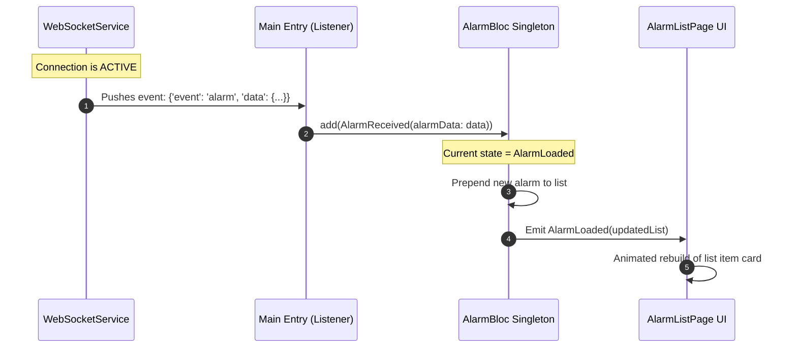
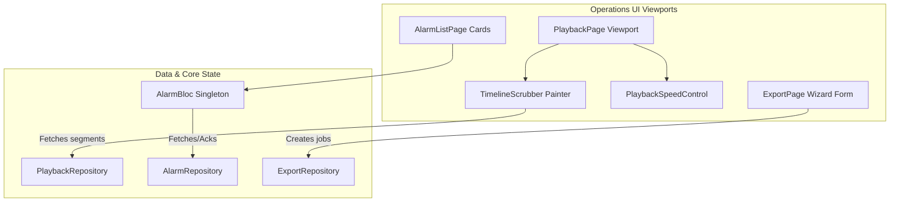

# Phase D: Mermaid Diagrams (Timeline Playback, Alarms & Exports)

This document contains the raw Mermaid diagram source code for **Micro-Phase D: Timeline Playback, Alarms & Exports (Operations)**.

---

## 1. Sequence Diagram: Real-Time WebSocket Alarm Ingestion Flow

---

## 2. Block Diagram: Operations Flow

