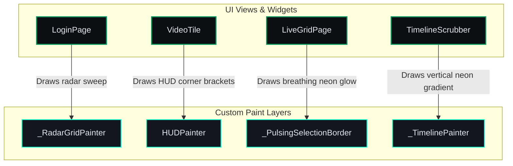

# Context & Boundaries — Premium Tactical HUD Redesign (Phase D.5)

This document defines the architectural context, operations boundaries, and performance constraints for the **Premium Tactical HUD Redesign (Phase D.5)**.

---

## 1. UI Redesign Context

This sub-phase focuses on upgrading the visual experience of the VMS client, transforming it into a high-performance, dark-matte tactical cockpit dashboard.

---

## 2. Visual Style Guidelines & Tokens

To ensure maximum tactical feel and minimize eye strain during long surveillance monitoring sessions, we use the following design system:

*   **Primary Background:** `#0D0E12` (deep matte space gray)
*   **Surface / Card Background:** `#14161F` (raised tactical dark gray)
*   **Accent Jade:** `#02965E` (standard active status color)
*   **Neon Cyan/Teal:** `#00FFCC` (tactical highlight/playhead tip)
*   **Alert Crimson:** `#D32F2F` (active warning/alarm border)
*   **Primary Text:** `#E2E8F0` (light slate)
*   **Subdued Label Text:** `#70788C` (medium gray)

---

## 3. Operations & Performance Boundaries

1. **Flat Widget Tree:** No heavy container stack nesting. All HUD overlays, bracket shapes, grids, and glowing lines are rendered inside `CustomPaint` layers using `Canvas.drawPath`, `Canvas.drawCircle`, and `Canvas.drawLine` directly.
2. **Video Render Isolation:** Video frame decoders are isolated via `RepaintBoundary` wrappers in the widget tree, preventing repaint propagation to static HUD layers.
3. **Hardware Acceleration:** Glow shadows are painted using `MaskFilter.blur(BlurStyle.normal, radius)` which uses hardware-accelerated Skia/Impeller blur pipelines.
4. **Test-Aware Animations:** All infinite loop animations verify test environments via `Platform.environment` to ensure `pumpAndSettle()` does not hang.
