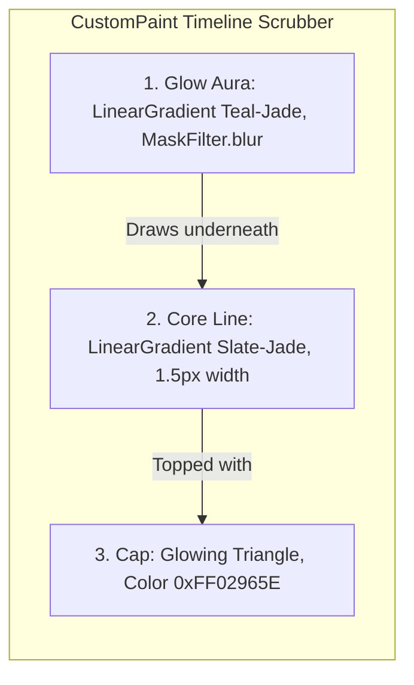

# Mermaid Diagrams — Premium Tactical HUD Redesign (Phase D.5)

This document contains visual diagrams mapping out the HUD design interactions and render flow.

---

## 1. Component Rendering Hierarchy

```mermaid
graph TD
    subgraph LoginPage [LoginPage Widget Tree]
        Bg[_RadarGridBackground]
        Card[Login Card]
        Form[LoginForm]
        Submit[_AnimatedSubmitButton]
    end

    subgraph LiveGridPage [LiveGridPage Widget Tree]
        Grid[GridView]
        Pulse[_PulsingSelectionBorder]
        Tile[VideoTile]
        HUD[HUDPainter Overlay]
        Telemetry[Telemetry Overlay]
    end

    subgraph PlaybackPage [PlaybackPage Widget Tree]
        Scrubber[TimelineScrubber]
        TimelinePainter[CustomPaint _TimelinePainter]
    end

    Bg -->|Animates Sweep| Card
    Form --> Submit
    
    Grid --> Pulse
    Pulse --> Tile
    Tile --> HUD
    Tile --> Telemetry

    Scrubber --> TimelinePainter
    
    classDef mainStyle fill:#0D0E12,stroke:#02965E,stroke-width:2px,color:#E2E8F0;
    classDef animStyle fill:#14161F,stroke:#00FFCC,stroke-width:1.5px,color:#E2E8F0;
    
    class LoginPage,LiveGridPage,PlaybackPage mainStyle;
    class Bg,Pulse,HUD,TimelinePainter animStyle;
```

---

## 2. Playhead Painting Layout

