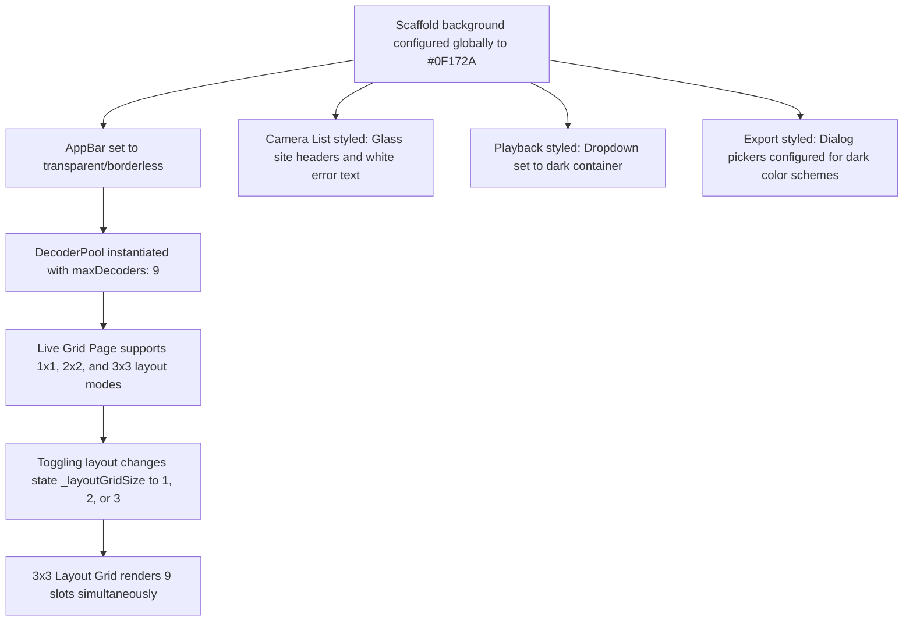

# Phase E: Premium Dark Glassmorphism & 3x3 Grid Mermaid Diagram

```mermaid
graph TD
    A[Scaffold background configured globally to #0F172A] --> B[AppBar set to transparent/borderless]
    B --> C[DecoderPool instantiated with maxDecoders: 9]
    C --> D[Live Grid Page supports 1x1, 2x2, and 3x3 layout modes]
    D --> E[Toggling layout changes state _layoutGridSize to 1, 2, or 3]
    E --> F[3x3 Layout Grid renders 9 slots simultaneously]
    
    A --> G[Camera List styled: Glass site headers and white error text]
    A --> H[Playback styled: Dropdown set to dark container]
    A --> I[Export styled: Dialog pickers configured for dark color schemes]
```
