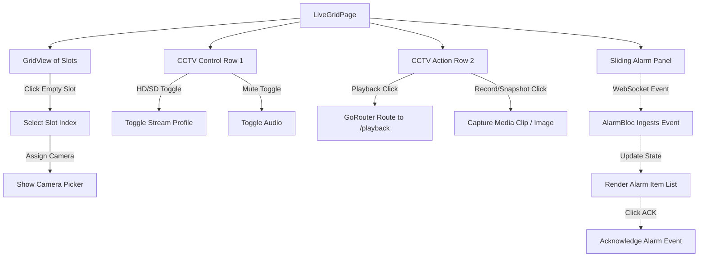

# Phase E: Dashboard Redesign Mermaid Diagrams

```mermaid
graph TD
    A[LiveGridPage] --> B[GridView of Slots]
    A --> C[CCTV Control Row 1]
    A --> D[CCTV Action Row 2]
    A --> E[Sliding Alarm Panel]
    
    B -->|Click Empty Slot| F[Select Slot Index]
    F -->|Assign Camera| G[Show Camera Picker]
    
    C -->|HD/SD Toggle| H[Toggle Stream Profile]
    C -->|Mute Toggle| I[Toggle Audio]
    
    D -->|Playback Click| J[GoRouter Route to /playback]
    D -->|Record/Snapshot Click| K[Capture Media Clip / Image]
    
    E -->|WebSocket Event| L[AlarmBloc Ingests Event]
    L -->|Update State| M[Render Alarm Item List]
    M -->|Click ACK| N[Acknowledge Alarm Event]
```
