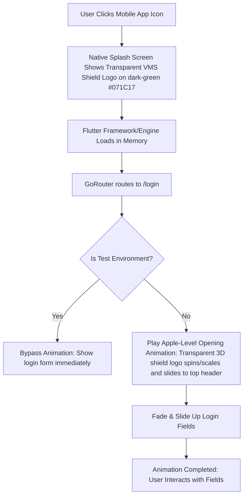

# Phase E: Premium Splash Animation Mermaid Diagram

```mermaid
graph TD
    A[User Clicks Mobile App Icon] --> B[Native Splash Screen Shows Transparent VMS Shield Logo on dark-green #071C17]
    B --> C[Flutter Framework/Engine Loads in Memory]
    C --> D[GoRouter routes to /login]
    
    D --> E{Is Test Environment?}
    E -- Yes --> F[Bypass Animation: Show login form immediately]
    E -- No --> G[Play Apple-Level Opening Animation: Transparent 3D shield logo spins/scales and slides to top header]
    
    G --> H[Fade & Slide Up Login Fields]
    H --> I[Animation Completed: User Interacts with Fields]
```
