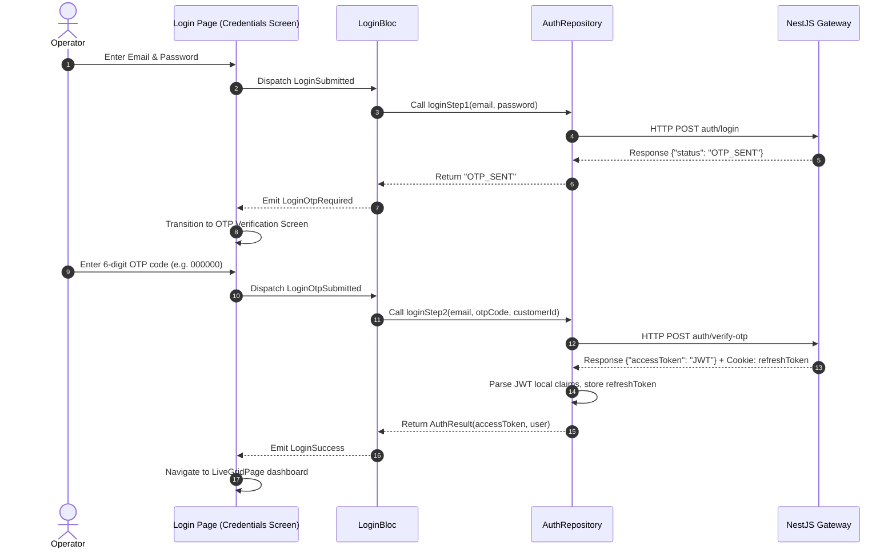

# Phase F Mermaid Sequence Diagram

```mermaid
sequenceDiagram
    autonumber
    actor Operator
    participant UI as Login Page (Credentials Screen)
    participant Bloc as LoginBloc
    participant Repo as AuthRepository
    participant API as NestJS Gateway

    Operator->>UI: Enter Email & Password
    UI->>Bloc: Dispatch LoginSubmitted
    Bloc->>Repo: Call loginStep1(email, password)
    Repo->>API: HTTP POST auth/login
    API-->>Repo: Response {"status": "OTP_SENT"}
    Repo-->>Bloc: Return "OTP_SENT"
    Bloc-->>UI: Emit LoginOtpRequired
    UI->>UI: Transition to OTP Verification Screen
    Operator->>UI: Enter 6-digit OTP code (e.g. 000000)
    UI->>Bloc: Dispatch LoginOtpSubmitted
    Bloc->>Repo: Call loginStep2(email, otpCode, customerId)
    Repo->>API: HTTP POST auth/verify-otp
    API-->>Repo: Response {"accessToken": "JWT"} + Cookie: refreshToken
    Repo->>Repo: Parse JWT local claims, store refreshToken
    Repo-->>Bloc: Return AuthResult(accessToken, user)
    Bloc-->>UI: Emit LoginSuccess
    UI->>UI: Navigate to LiveGridPage dashboard
```
