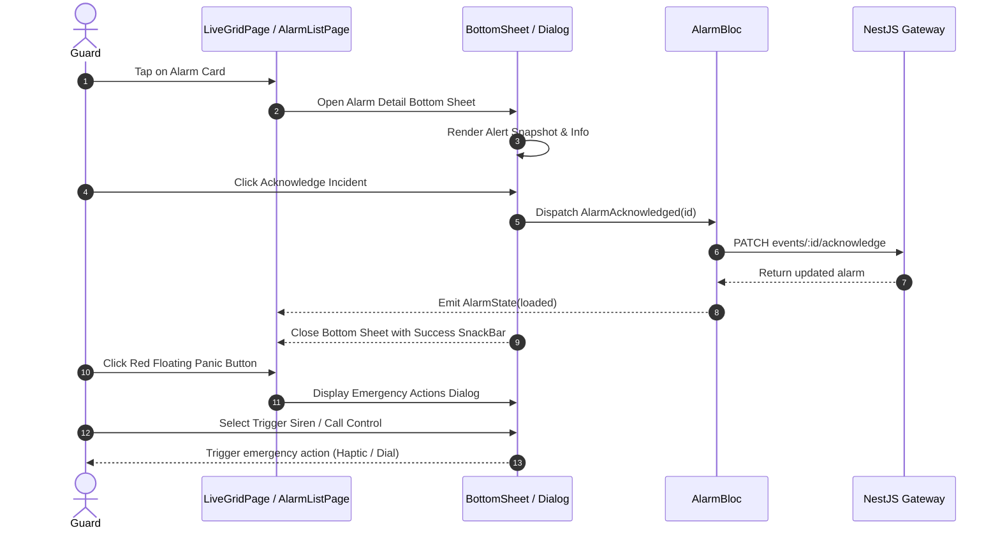

# Phase G Mermaid Sequence Diagram

```mermaid
sequenceDiagram
    autonumber
    actor Guard
    participant UI as LiveGridPage / AlarmListPage
    participant Modal as BottomSheet / Dialog
    participant Bloc as AlarmBloc
    participant API as NestJS Gateway

    %% Alarm Detail Modal Flow
    Guard->>UI: Tap on Alarm Card
    UI->>Modal: Open Alarm Detail Bottom Sheet
    Modal->>Modal: Render Alert Snapshot & Info
    Guard->>Modal: Click Acknowledge Incident
    Modal->>Bloc: Dispatch AlarmAcknowledged(id)
    Bloc->>API: PATCH events/:id/acknowledge
    API-->>Bloc: Return updated alarm
    Bloc-->>UI: Emit AlarmState(loaded)
    Modal-->>UI: Close Bottom Sheet with Success SnackBar

    %% Panic Button Flow
    Guard->>UI: Click Red Floating Panic Button
    UI->>Modal: Display Emergency Actions Dialog
    Guard->>Modal: Select Trigger Siren / Call Control
    Modal-->>Guard: Trigger emergency action (Haptic / Dial)
```
