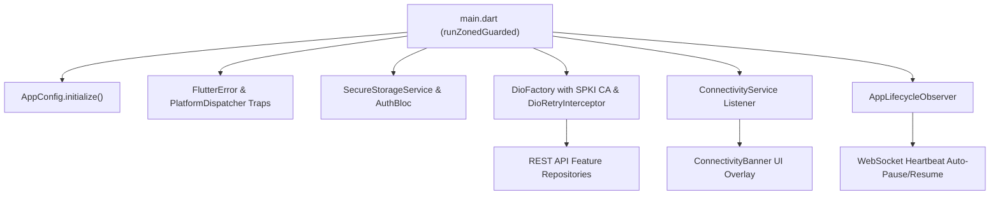

```mermaid
graph TD
    A["main.dart (runZonedGuarded)"] --> B["AppConfig.initialize()"]
    A --> C["FlutterError & PlatformDispatcher Traps"]
    A --> D["SecureStorageService & AuthBloc"]
    A --> E["DioFactory with SPKI CA & DioRetryInterceptor"]
    A --> F["ConnectivityService Listener"]
    A --> G["AppLifecycleObserver"]
    F --> H["ConnectivityBanner UI Overlay"]
    G --> I["WebSocket Heartbeat Auto-Pause/Resume"]
    E --> J["REST API Feature Repositories"]
```
