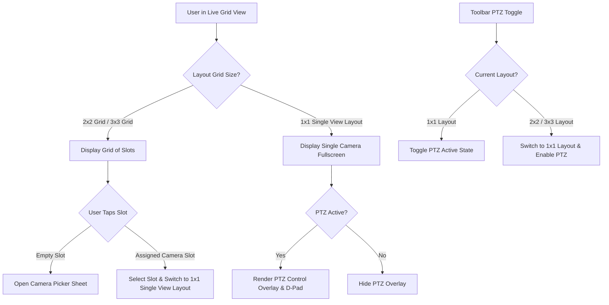

# Phase I Mermaid Diagram - Interaction Flow & PTZ Scoping

```mermaid
flowchart TD
    A[User in Live Grid View] --> B{Layout Grid Size?}
    
    B -- 2x2 Grid / 3x3 Grid --> C[Display Grid of Slots]
    C --> D{User Taps Slot}
    D -- Empty Slot --> E[Open Camera Picker Sheet]
    D -- Assigned Camera Slot --> F[Select Slot & Switch to 1x1 Single View Layout]
    
    B -- 1x1 Single View Layout --> G[Display Single Camera Fullscreen]
    G --> H{PTZ Active?}
    H -- Yes --> I[Render PTZ Control Overlay & D-Pad]
    H -- No --> J[Hide PTZ Overlay]
    
    K[Toolbar PTZ Toggle] --> L{Current Layout?}
    L -- 1x1 Layout --> M[Toggle PTZ Active State]
    L -- 2x2 / 3x3 Layout --> N[Switch to 1x1 Layout & Enable PTZ]
```
