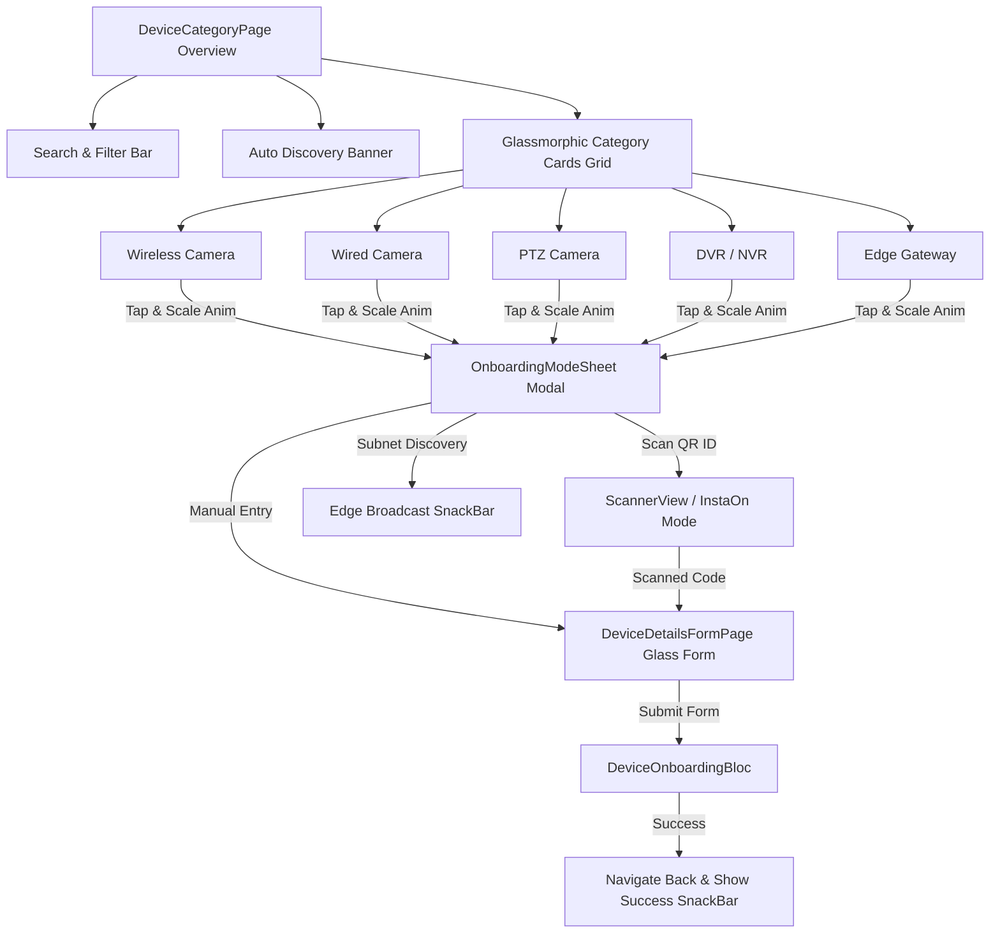

# Phase J Mermaid — Device Onboarding UI Architecture & User Interaction Flow

```mermaid
graph TD
    A[DeviceCategoryPage Overview] --> B[Search & Filter Bar]
    A --> C[Auto Discovery Banner]
    A --> D[Glassmorphic Category Cards Grid]

    D --> D1[Wireless Camera]
    D --> D2[Wired Camera]
    D --> D3[PTZ Camera]
    D --> D4[DVR / NVR]
    D --> D5[Edge Gateway]

    D1 -->|Tap & Scale Anim| E[OnboardingModeSheet Modal]
    D2 -->|Tap & Scale Anim| E
    D3 -->|Tap & Scale Anim| E
    D4 -->|Tap & Scale Anim| E
    D5 -->|Tap & Scale Anim| E

    E -->|Scan QR ID| F[ScannerView / InstaOn Mode]
    E -->|Manual Entry| G[DeviceDetailsFormPage Glass Form]
    E -->|Subnet Discovery| H[Edge Broadcast SnackBar]

    F -->|Scanned Code| G
    G -->|Submit Form| I[DeviceOnboardingBloc]
    I -->|Success| J[Navigate Back & Show Success SnackBar]
```
