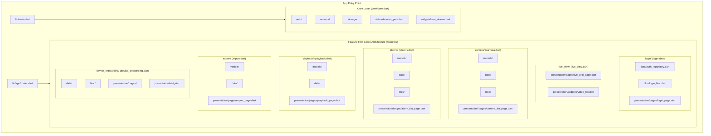

# Phase L: Enterprise Architecture & Feature-First Folder Restructuring - Mermaid Architecture

```mermaid
flowchart TD
    subgraph Core_Module["Core Layer (core/core.dart)"]
        AUTH[auth/]
        NET[network/]
        STO[storage/]
        VID[video/decoder_pool.dart]
        WID[widgets/vms_drawer.dart]
    end

    subgraph Feature_Modules["Feature-First Clean Architecture (features/)"]
        subgraph Login_Feature["login/ (login.dart)"]
            LD[data/auth_repository.dart]
            LB[bloc/login_bloc.dart]
            LP[presentation/pages/login_page.dart]
        end

        subgraph LiveView_Feature["live_view/ (live_view.dart)"]
            LV_P[presentation/pages/live_grid_page.dart]
            LV_W[presentation/widgets/video_tile.dart]
        end

        subgraph Camera_Feature["camera/ (camera.dart)"]
            C_M[models/]
            C_D[data/]
            C_B[bloc/]
            C_P[presentation/pages/camera_list_page.dart]
        end

        subgraph Alarms_Feature["alarms/ (alarms.dart)"]
            A_M[models/]
            A_D[data/]
            A_B[bloc/]
            A_P[presentation/pages/alarm_list_page.dart]
        end

        subgraph Playback_Feature["playback/ (playback.dart)"]
            PB_M[models/]
            PB_D[data/]
            PB_P[presentation/pages/playback_page.dart]
        end

        subgraph Export_Feature["export/ (export.dart)"]
            EX_M[models/]
            EX_D[data/]
            EX_P[presentation/pages/export_page.dart]
        end

        subgraph Onboarding_Feature["device_onboarding/ (device_onboarding.dart)"]
            O_D[data/]
            O_B[bloc/]
            O_P[presentation/pages/]
            O_W[presentation/widgets/]
        end
    end

    subgraph App_Bootstrapping["App Entry Point"]
        MAIN[lib/main.dart] --> Core_Module
        ROUTER[lib/app/router.dart] --> Feature_Modules
    end
```
