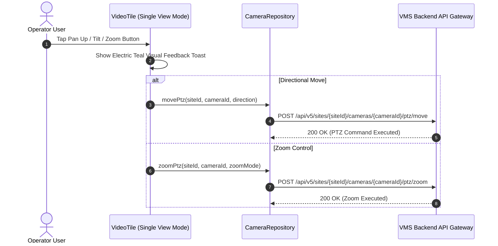

# Phase M: PTZ Camera Control API Integration - Mermaid Architecture

```mermaid
sequenceDiagram
    autonumber
    actor Operator as Operator User
    participant VT as VideoTile (Single View Mode)
    participant CR as CameraRepository
    participant API as VMS Backend API Gateway

    Operator->>VT: Tap Pan Up / Tilt / Zoom Button
    VT->>VT: Show Electric Teal Visual Feedback Toast
    alt Directional Move
        VT->>CR: movePtz(siteId, cameraId, direction)
        CR->>API: POST /api/v5/sites/{siteId}/cameras/{cameraId}/ptz/move
        API-->>CR: 200 OK (PTZ Command Executed)
    else Zoom Control
        VT->>CR: zoomPtz(siteId, cameraId, zoomMode)
        CR->>API: POST /api/v5/sites/{siteId}/cameras/{cameraId}/ptz/zoom
        API-->>CR: 200 OK (Zoom Executed)
    end
```
