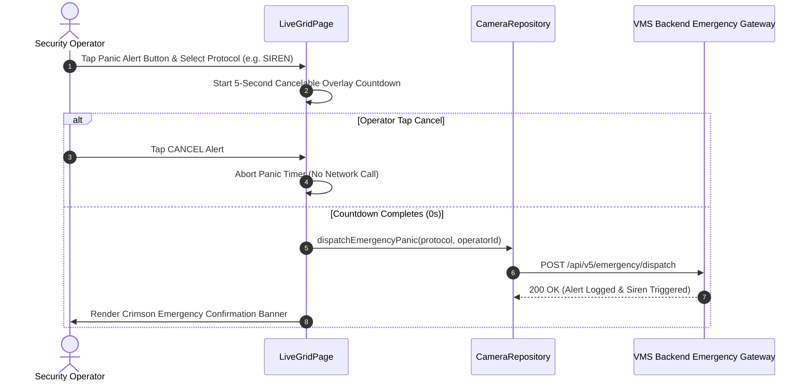

# Phase N: Emergency Control Room Panic Dispatch API Integration - Mermaid Architecture

```mermaid
sequenceDiagram
    autonumber
    actor Operator as Security Operator
    participant LGP as LiveGridPage
    participant CR as CameraRepository
    participant API as VMS Backend Emergency Gateway

    Operator->>LGP: Tap Panic Alert Button & Select Protocol (e.g. SIREN)
    LGP->>LGP: Start 5-Second Cancelable Overlay Countdown
    alt Operator Tap Cancel
        Operator->>LGP: Tap CANCEL Alert
        LGP->>LGP: Abort Panic Timer (No Network Call)
    else Countdown Completes (0s)
        LGP->>CR: dispatchEmergencyPanic(protocol, operatorId)
        CR->>API: POST /api/v5/emergency/dispatch
        API-->>CR: 200 OK (Alert Logged & Siren Triggered)
        LGP->>Operator: Render Crimson Emergency Confirmation Banner
    end
```
