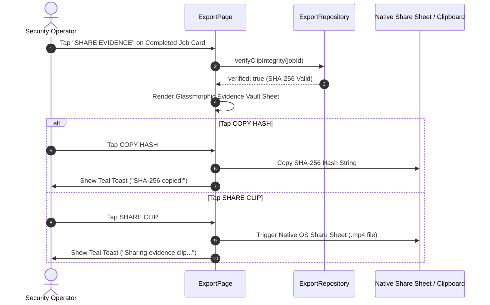

# Phase O: Native Video Evidence Export File Sharing & Evidence Saver Integration - Mermaid Architecture

```mermaid
sequenceDiagram
    autonumber
    actor SecurityOperator as Security Operator
    participant EP as ExportPage
    participant ER as ExportRepository
    participant OS as Native Share Sheet / Clipboard

    SecurityOperator->>EP: Tap "SHARE EVIDENCE" on Completed Job Card
    EP->>ER: verifyClipIntegrity(jobId)
    ER-->>EP: verified: true (SHA-256 Valid)
    EP->>EP: Render Glassmorphic Evidence Vault Sheet
    alt Tap COPY HASH
        SecurityOperator->>EP: Tap COPY HASH
        EP->>OS: Copy SHA-256 Hash String
        EP->>SecurityOperator: Show Teal Toast ("SHA-256 copied!")
    else Tap SHARE CLIP
        SecurityOperator->>EP: Tap SHARE CLIP
        EP->>OS: Trigger Native OS Share Sheet (.mp4 file)
        EP->>SecurityOperator: Show Teal Toast ("Sharing evidence clip...")
    end
```
