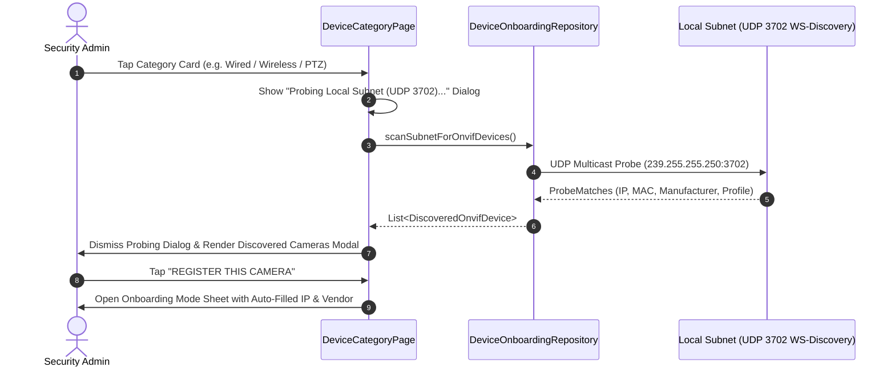

# Phase P: ONVIF Subnet Packet Scanner & Dynamic Device Discovery Integration - Mermaid Architecture

```mermaid
sequenceDiagram
    autonumber
    actor SecurityAdmin as Security Admin
    participant DCP as DeviceCategoryPage
    participant DOR as DeviceOnboardingRepository
    participant LAN as Local Subnet (UDP 3702 WS-Discovery)

    SecurityAdmin->>DCP: Tap Category Card (e.g. Wired / Wireless / PTZ)
    DCP->>DCP: Show "Probing Local Subnet (UDP 3702)..." Dialog
    DCP->>DOR: scanSubnetForOnvifDevices()
    DOR->>LAN: UDP Multicast Probe (239.255.255.250:3702)
    LAN-->>DOR: ProbeMatches (IP, MAC, Manufacturer, Profile)
    DOR-->>DCP: List<DiscoveredOnvifDevice>
    DCP->>SecurityAdmin: Dismiss Probing Dialog & Render Discovered Cameras Modal
    SecurityAdmin->>DCP: Tap "REGISTER THIS CAMERA"
    DCP->>SecurityAdmin: Open Onboarding Mode Sheet with Auto-Filled IP & Vendor
```
