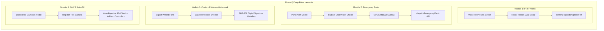

# Phase Q: Exhaustive Deep Enhancement of Core Enterprise Modules - Mermaid Architecture

```mermaid
flowchart TD
    subgraph Core_Enterprise_Enhancements["Phase Q Deep Enhancements"]
        direction TB
        subgraph PTZ_Presets["Module 1: PTZ Presets"]
            P1[VideoTile Presets Button] --> P2[Recall Preset 1/2/3 Modal]
            P2 --> P3[cameraRepository.presetPtz]
        end

        subgraph Panic_Silent["Module 2: Emergency Panic"]
            E1[Panic Alert Modal] --> E2[SILENT DISPATCH Choice]
            E2 --> E3[5s Countdown Overlay]
            E3 --> E4[dispatchEmergencyPanic API]
        end

        subgraph Export_Watermark["Module 3: Custom Evidence Watermark"]
            EX1[Export Wizard Form] --> EX2[Case Reference ID Field]
            EX2 --> EX3[SHA-256 Digital Signature Metadata]
        end

        subgraph Onboarding_AutoFill["Module 4: ONVIF Auto-Fill"]
            O1[Discovered Cameras Modal] --> O2[Register This Camera]
            O2 --> O3[Auto-Populate IP & Vendor in Form Controllers]
        end
    end
```
