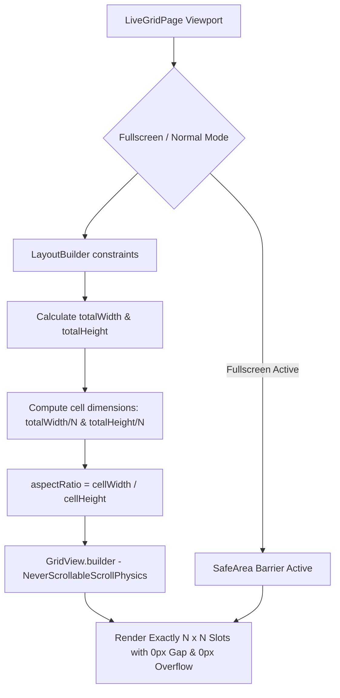

# Phase S — Mermaid Architecture: Fullscreen Responsive Matrix Grid

```mermaid
flowchart TD
    A[LiveGridPage Viewport] --> B{Fullscreen / Normal Mode}
    B --> C[LayoutBuilder constraints]
    C --> D[Calculate totalWidth & totalHeight]
    D --> E[Compute cell dimensions: totalWidth/N & totalHeight/N]
    E --> F[aspectRatio = cellWidth / cellHeight]
    F --> G[GridView.builder - NeverScrollableScrollPhysics]
    G --> H[Render Exactly N x N Slots with 0px Gap & 0px Overflow]
    B -->|Fullscreen Active| I[SafeArea Barrier Active]
    I --> H
```
