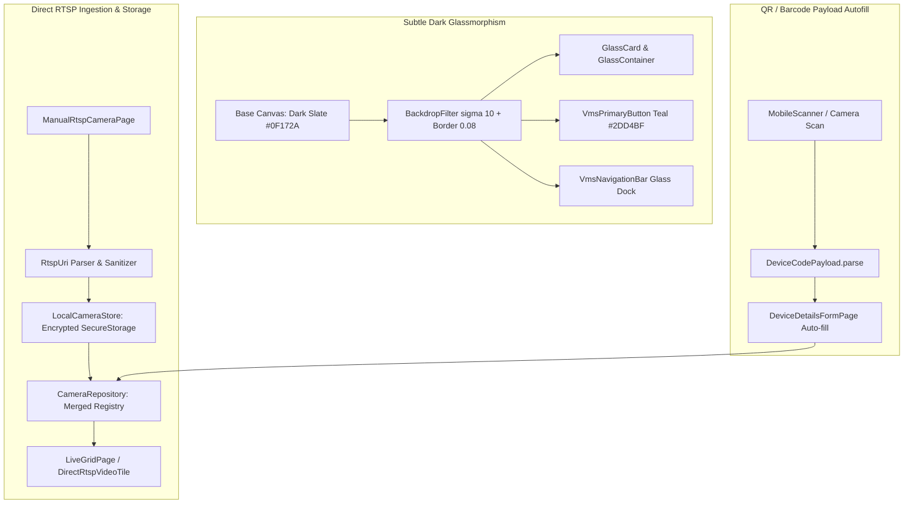

# Phase T — Mermaid Architecture: Subtle Dark Glassmorphism, Manual RTSP & Device Code Autofill

```mermaid
flowchart TD
    subgraph UI_Design_System [Subtle Dark Glassmorphism]
        Canvas[Base Canvas: Dark Slate #0F172A] --> Glass[BackdropFilter sigma 10 + Border 0.08]
        Glass --> Cards[GlassCard & GlassContainer]
        Glass --> Buttons[VmsPrimaryButton Teal #2DD4BF]
        Glass --> Nav[VmsNavigationBar Glass Dock]
    end

    subgraph Direct_RTSP_Flow [Direct RTSP Ingestion & Storage]
        ManualPage[ManualRtspCameraPage] --> Parser[RtspUri Parser & Sanitizer]
        Parser --> Store[LocalCameraStore: Encrypted SecureStorage]
        Store --> Repo[CameraRepository: Merged Registry]
        Repo --> LiveGrid[LiveGridPage / DirectRtspVideoTile]
    end

    subgraph Scanner_Flow [QR / Barcode Payload Autofill]
        Scanner[MobileScanner / Camera Scan] --> CodePayload[DeviceCodePayload.parse]
        CodePayload --> Form[DeviceDetailsFormPage Auto-fill]
        Form --> Repo
    end
```

