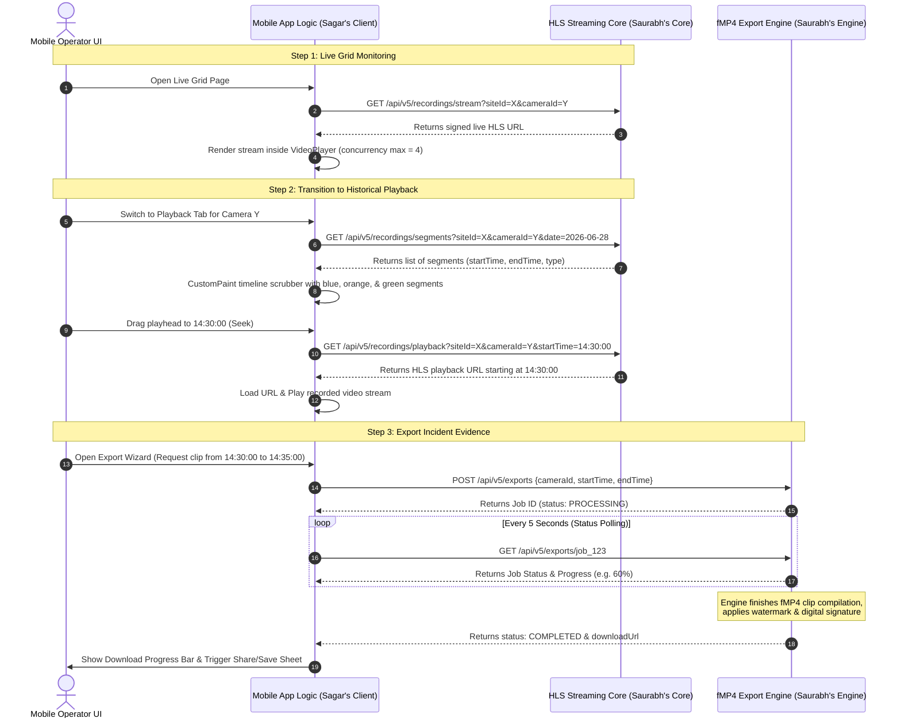

# Integration Specifications: Media Core & Export Engine (Saurabh's Domain)

Dear Saurabh,

To integrate the mobile client application with the Media Core and fMP4 Export Engine successfully, we need to align on the following APIs, formats, and data flows. 

Below is the detailed breakdown of **what we need**, **why we need it**, and **how these components combine** to form the end-to-end video operations pipeline.

---

## 1. Summary of Required Endpoints

| Endpoint | HTTP Method | Query / Body Parameters | Output Payload | Why it is Needed |
|---|---|---|---|---|
| **Live Stream URL** `/api/v5/recordings/stream` | `GET` | `siteId` (string) `cameraId` (string) | `{ "hlsUrl": "https://media.vms.../stream.m3u8?token=xyz" }` | To render live feeds inside the 2x2 grid slots on the Dashboard. |
| **Recording Segments** `/api/v5/recordings/segments` | `GET` | `siteId` (string) `cameraId` (string) `date` (ISO 8601 date string) | `{ "data": [ { "startTime": "...", "endTime": "...", "type": "CONTINUOUS/MOTION/SCHEDULED" } ] }` | To paint color-coded recording blocks on the 24-hour timeline scrubber. |
| **Seek Playback URL** `/api/v5/recordings/playback` | `GET` | `siteId` (string) `cameraId` (string) `startTime` (ISO 8601) | `{ "hlsUrl": "https://media.vms.../playback.m3u8?token=abc" }` | To stream recorded footage starting at the exact seek timestamp. |
| **Create Export Job** `/api/v5/exports` | `POST` | `{ "siteId": "...", "cameraId": "...", "startTime": "...", "endTime": "..." }` | `{ "data": { "id": "job_123", "status": "PENDING/PROCESSING", "progress": 0.0 } }` | To trigger clip compilation, watermarking, and signing. |
| **Export Job Status** `/api/v5/exports/{id}` | `GET` | None (Route Param: `id`) | `{ "data": { "id": "job_123", "status": "COMPLETED", "downloadUrl": "...", "progress": 1.0 } }` | To poll job status and retrieve the download link for the fMP4 clip. |

---

## 2. Why We Need These Items (Component Breakdown)

### A. Live HLS Streams
*   **Need:** A signed HLS `.m3u8` feed URL containing a short-lived token.
*   **Why:** The mobile app's Dashboard displays up to 4 concurrent live camera feeds. The player needs direct, authenticated access to the video segments. A short-lived token ensures secure, authorized streaming without exposing long-term credentials.

### B. Recording Segments
*   **Need:** An array of start/end times categorized by recording type (`CONTINUOUS`, `MOTION`, `SCHEDULED`).
*   **Why:** Rather than rendering heavy widgets, the mobile timeline scrubber uses a high-performance `CustomPainter` to paint color blocks representing when video is available. We need this API to know exactly where to draw these blocks.

### C. Playback Seek URLs
*   **Need:** An HLS play link starting exactly at the timestamp specified by the operator.
*   **Why:** When the user scrubs the timeline or taps a recorded block, the app translates the horizontal offset to a timestamp. We pass this timestamp to the media core so it can begin compiling/indexing segments starting from that exact frame.

### D. Evidence Clip Exports
*   **Need:** Triggering clip creation (`fMP4` container), watermarking/metadata signing, and status monitoring.
*   **Why:** Operators need to download legal evidence clips of security incidents. We need a REST interface to start the job, monitor its processing progress, and finally download the signed file to save it to the phone's gallery.

---

## 3. End-to-End Unified Media Flow (How They Work Together)

The diagram below illustrates how these APIs combine to drive the full operator workflow: from live grid monitoring, to historical playback, and finally exporting an evidence file.

---

## 4. Key Design Considerations for Media Core

1. **Short-Lived Tokens:** Signed HLS tokens in `hlsUrl` should expire after **60 seconds**. Once the player initiates connection and starts streaming, the session key remains active; the short expiration is only to prevent URLs from being shared or reused.
2. **CORS Headers:** Ensure that the media streaming server returns correct CORS headers allowing video players running inside mobile web views/sandboxes to read segment indices.
3. **Download File Format:** The export engine must output a standard, web-playable `fMP4` container so the mobile system share sheet can write the evidence clip directly to iOS/Android galleries without transcoding.
